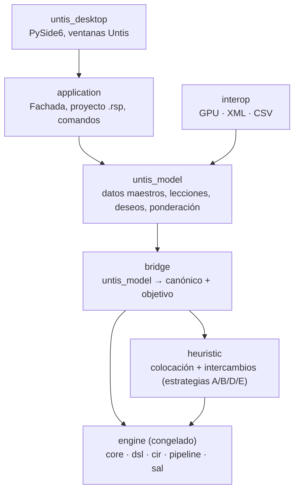
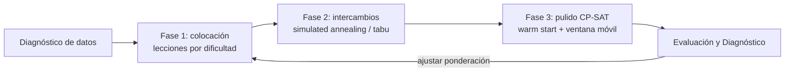
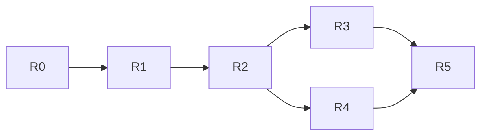

# RealSchool → Untis-class: documento maestro de refactorización

**Fecha:** 2026-09-18 · **Autor:** Edwin Ortiz Herazo · **Repositorio:** https://github.com/chronosedwin8/RealSchool
**Estado:** fuente de verdad vigente. Supersede a `Prompt3.md`, `PLAN_DE_TRABAJO.md` y `FasesPosteriores/ARCHITECTURE_AND_BENCHMARK.md` en todo lo que contradiga.

---

## 0. Instrucciones de ejecución para Claude Code

**Misión:** ejecutar la refactorización completa descrita en este documento, de la fase R0 a la R5, hasta el final, sin detenerse a pedir confirmación entre fases. Cada fase termina con `scripts/check.py` en verde (ruff format, ruff check, mypy --strict, pytest) y un commit con mensaje `R<n>: <entregable>`.

**Decisiones ya tomadas (no reabrir):**

1. Motor híbrido: heurística nueva (`heuristic/`) para generar desde cero; CP-SAT (motor actual) para reparar, pulir y demostrar infactibilidad.
2. UI en PySide6 (se conserva el andamiaje de ADR-032); una UI web se evaluará después de R5, no ahora.
3. Idiomas es/de desde R4 mediante `QTranslator` y archivos `.ts`; el español es el idioma fuente.
4. Planificación por alumno (IB) se difiere; `StudentGroup` y `Term` quedan como puntos de extensión.
5. Formato de proyecto propio: `.rsp` (ZIP con un JSON por entidad + `manifest.json` versionado).
6. El producto conserva el nombre RealSchool.

**Reglas de trabajo:**

- Trabajar en la rama `untis-refactor`; etiquetar `engine-1.0` sobre `main` antes del primer cambio.
- El motor congelado (`core`, `dsl`, `cir`, `sal`, `pipeline`, `engine`, `benchmarks`) solo se modifica para las extensiones listadas en la sección 7; cada extensión lleva su ADR corto (`docs/adr/ADR-035+`).
- Python 3.14 del sistema, `mypy --strict`, sin `Any` nuevos, sin dependencias nuevas fuera de `pyproject.toml` salvo justificación en ADR.
- Tests de frontera obligatorios (ver sección 4): nada fuera de `bridge` importa `core`; `untis_desktop` solo importa `scheduling_platform.application`.
- Los cuatro `untis.xml` reales (cursos 2023-2027, ya referenciados por `scripts/ds04_colegio_aleman.py`) son los fixtures de regresión de todas las fases. Si no están en el repo, pedirlos al usuario en el primer mensaje y continuar con los datasets sintéticos mientras tanto.
- No copiar textos, iconos ni capturas de Untis; replicar organización de ventanas y modelo de interacción con nombres genéricos (Deseos, Ponderación, Diagnóstico).
- Al cerrar cada fase: actualizar `README.md`, `docs/architecture/overview.md` y `PLAN_DE_TRABAJO.md` con el estado real; escribir un resumen de 10 líneas al usuario con lo hecho, lo pendiente y los números medidos.
- Definición de terminado global (R5): un usuario de Untis carga su XML, edita lecciones, ajusta ponderaciones, corre A y B, lee el Diagnóstico, coloca a mano en el Diálogo de planificación, imprime horarios y exporta `GPU001.TXT` que MiUntisWeb abre sin cambios.

---

## 1. Resumen ejecutivo

RealSchool ya tiene el motor que Untis no tiene (CP-SAT exacto, explicación de conflictos, warm start); lo que le falta es **ser Untis por fuera**: el mismo modelo mental de datos maestros, la misma escala de deseos (−3…+3), el mismo diálogo de ponderaciones (0…5), el mismo diagnóstico y el mismo diálogo de planificación. La propuesta es una refactorización en cuatro cortes radicales:

1. **Invertir la prioridad del proyecto:** el producto pasa a ser el **cliente de escritorio + el formato de proyecto**; el motor genérico (core/dsl/cir/sal) se congela como librería estable y deja de ser el centro de gravedad de los ADR.
2. **Adoptar el vocabulario de Untis como capa de dominio pública** (`untis_model`): rejilla de tiempo por sección, clases, profesores, aulas, materias, lecciones con acoples, deseos de tiempo, ponderaciones. La capa `academic` actual se retira y el adaptador Untis (hoy solo importador) se convierte en el único puente `untis_model → canónico`.
3. **Reemplazar los 24 plugins hard/soft del catálogo por las ~40 ponderaciones de Untis** como única fuente de configuración del objetivo: el usuario nunca ve "HC-07" ni "SC-04", ve los mismos deslizadores que en Untis.
4. **Reescribir la UI como réplica funcional de Untis** (barra de ventanas, ventanas de datos maestros en cuadrícula, ventana de Lecciones, Deseos, Ponderación, Optimización con estrategias A/B/D/E, Diagnóstico, Diálogo de planificación con arrastrar y soltar) y **hablar sus archivos** (GPU y XML de importación/exportación) para que un colegio pueda migrar y volver sin pérdida.

Veredicto sobre el código actual: la arquitectura de abajo (motor) está sobredimensionada y bien construida; la de arriba (dominio + UI) está en la dirección correcta pero con el vocabulario equivocado. La refactorización no reescribe el motor: **reescribe todo lo que está por encima de la Fachada**, y toca el motor solo para añadir lo que Untis exige y hoy no existe (períodos dobles/bloques, secuencias de materias, optimización de profesores, optimización de aulas por prioridad, planificación por períodos lectivos).

---

## 2. Diagnóstico del repositorio hoy

El repo (81 commits, último el 22 jul 2026, ~19.100 líneas Python en `src/`, 61 archivos de test, 33 ADR) es un **motor genérico de calendarización** con una app de escritorio incipiente. Está muy por encima de un prototipo: `ruff` + `mypy --strict` + `pytest` + `hypothesis` en CI, Docker, MkDocs, binario nativo, formato propio `.bjs`.

| Capa | Estado | Valor para el objetivo Untis | Decisión |
| --- | --- | --- | --- |
| `core` (Resource, Task, TimeGrid, Constraint) | Completa, inmutable, sin ortools | Alto: absorbió el colegio real sin cambios (ADR-016) | **Conservar** |
| `dsl` → `cir` → `sal` (CP-SAT, MIP, Fake) | Completa, con pases de optimización | Alto pero invisible al usuario | **Congelar** como librería |
| `pipeline` (graph builder, conflict explanation, telemetría) | Completa | Alto: base del Diagnóstico | **Conservar** |
| `engine` (validation, metrics, reoptimization, simulation) | Completa; warm start repara horarios reales en <30 s (ADR-017) | Alto: base de Optimizar/Reparar | **Conservar** |
| `plugins/catalog` (14 HC + 10 SC) | Completo pero con ids técnicos y pesos no Untis | Medio: cubre ~40 % de las ponderaciones de Untis | **Reemplazar** por ponderaciones Untis |
| `academic` (Teacher, Room, Subject, adapter) | Completa pero vocabulario propio, sin secciones ni acoples nativos | Bajo: duplica lo que `untis/adapter.py` ya modela mejor | **Retirar** |
| `untis/` (parser XmlInterface 3.0 + adapter con union-find de acoples) | Solo importación | Alto: es el verdadero modelo de dominio | **Promover** a capa de dominio |
| `application` (Fachada, `.bjs`, SchoolWeek, comandos) | Completa | Alto | Conservar y ampliar |
| `scheduling_desktop` (PySide6, 17 módulos, 3.800 líneas) | MVP vertical; editor de horario y lecciones son los más maduros | Medio: organización por "módulos" propia, no por ventanas Untis | **Reescribir** la capa de presentación |

Hallazgos que condicionan la refactorización:

- **El motor no genera desde cero un horario del tamaño del Colegio Alemán en 90 s** (1.683–1.930 clases); sí lo repara y optimiza partiendo de uno existente (ADR-016/017). Untis lo genera en minutos con heurísticas. Igualar a Untis exige un motor **híbrido**: heurística constructiva rápida + CP-SAT para pulir, no CP-SAT solo.
- **La rejilla es de minutos reales** (5 × 680 slots) porque las 8 jornadas del colegio no comparten horas de período. Untis resuelve lo mismo con **varias rejillas de tiempo por sección** más un "reloj" común: es el mismo modelo, expresado como lo espera el usuario. ADR-033 (`SchoolWeek`) ya camina hacia ahí.
- **Los acoples (Kopplungen) se detectan por inferencia** (union-find). En Untis son un dato maestro explícito de la lección. Deben pasar a ser dato de entrada, no deducción.
- **Las ponderaciones son pesos numéricos por plugin** en `engine.yaml`; Untis usa una escala 0–5 por criterio y una escala −3…+3 por deseo. Sin esa doble escala no hay "misma funcionalidad".
- **Faltan conceptos Untis sin equivalente en el core:** períodos dobles y bloques de lección (min/max por lección), secuencias de materias, clases sin profesor fijo (optimización de profesores), prioridad de aulas y aula alternativa, períodos lectivos (Perioden) dentro del año, departamentos, grupos de alumnos como entidad, valores semanales (Wochenwerte), y exportación GPU/XML.
- **La UI actual está organizada por módulos de producto** (Dashboard, Notification Center, Plugin Manager, Help Center) que Untis no tiene, y no tiene lo que Untis sí: ventana de Ponderación, ventana de Diagnóstico, Diálogo de planificación, cuadrículas de datos maestros con columnas configurables.

---

## 3. Untis como referencia: qué hay que replicar

Untis es un modelo de datos maestros + un flujo de trabajo fijo, no solo un motor. Fuentes: [manual de optimización](https://webhelp.untis.at/HTML/WebHelp/uk/untis/opstundenplan-optimierung.htm), [ponderación](https://webhelp.untis.at/HTML/WebHelp/uk/untis/opgewichtung.htm), [parámetros de ponderación](https://webhelp.untis.at/HTML/WebHelp/uk/untis/opdie_gewichtungsparameter.htm), [estrategias](https://webhelp.untis.at/HTML/WebHelp/uk/untis/optimierungsstrategienke.htm), [evaluación](https://webhelp.untis.at/HTML/WebHelp/uk/untis/bewertungke.htm).

| Bloque Untis | Contenido esencial | Estado en RealSchool |
| --- | --- | --- |
| Rejilla de tiempo (Zeitraster) | Días, períodos, hora de reloj por período, mañana/tarde, varias rejillas por sección, tipo de período (lectivo/recreo) | Parcial (`SchoolWeek`, ADR-033) |
| Datos maestros: Clases | Nombre, sección, aula base, alumnos, nivel, períodos/día mín-máx, almuerzo mín-máx, materias principales/día, deseos | Parcial: falta mín-máx, almuerzo, sección |
| Datos maestros: Profesores | Nombre, departamento, aula base, períodos/día mín-máx, días/semana máx, huecos mín-máx, almuerzo, períodos seguidos máx, deseos | Parcial: huecos y días/semana sí; almuerzo y seguidos parcial |
| Datos maestros: Aulas | Nombre, capacidad, aula alternativa (cadena), peso de aula (0-4), deseos | Parcial: capacidad sí; alternativa y peso no |
| Datos maestros: Materias | Nombre, materia principal, sin mismo día, doble período obligatorio, aula obligatoria, grupo de materias, deseos | Parcial |
| Departamentos, grupos de alumnos, grupos de lecciones, períodos lectivos (Perioden) | Estructura organizativa y validez temporal de una lección dentro del año | No existe |
| Ventana de Lecciones | Una fila por lección: clase(s), profesor(es), materia, aula, períodos/semana, períodos dobles mín-máx, bloques, acoples (líneas con mismo nº de lección), fijar, ignorar, no en el mismo día, secuencia, valor semanal | Parcial (`lessons.py`): acoples inferidos, faltan dobles/bloques/secuencias |
| Deseos de tiempo (Zeitwünsche) | Rejilla por clase/profesor/aula/materia con escala −3 (imposible) … +3 (muy deseable), deseos por día completo y "deseos no especificados" (p. ej. 2 tardes libres, día libre cualquiera) | Parcial: `desiderata.py` es bloqueo binario |
| Ponderación (Wichtung) | Deslizadores 0-5 en pestañas Profesores 1, Profesores 2, Clases, Materias, Materias principales, Aulas, Distribución de períodos, Deseos de tiempo, Análisis | No existe (pesos YAML por plugin) |
| Optimización | Estrategias A (rápida), B (compleja), D (colocación % compleja), E (nocturna); nº de horarios a generar; optimización de profesores y de aulas; 2 fases: colocación por dificultad y luego intercambios | No existe como diálogo; motor CP-SAT único |
| Evaluación | Número de evaluación (suma de violaciones ponderadas), períodos no colocados, choques, resumen por pestaña | Parcial: `metrics.py` y `validation.py` |
| Diagnóstico | Ventana con entrada de datos (errores/advertencias) y horario (violaciones por criterio, ordenadas por peso, con salto a la lección) | Parcial: `validation_center.py`, `conflict_explanation.py` |
| Diálogo de planificación (Planungsdialog) | Cuadrícula de una clase/profesor/aula con arrastrar y soltar, colores de conflicto en tiempo real, intercambio de períodos, cadenas de intercambio, desprogramar, fijar | Parcial: `schedule_editor.py` (colocar a mano, F7) |
| Formatos de horario | Formatos configurables por tipo (clase, profesor, aula), varios horarios en una ventana, sincronización, impresión | Mínimo |
| Import/Export | GPU (archivos de texto `GPU001.TXT`…), XML de interfaz (XmlInterface 3.0), CSV | Solo importación XML |

Dos ideas de Untis que gobiernan todo el diseño:

- **Doble escala.** Los datos maestros llevan *deseos* (−3…+3) y las reglas llevan *ponderaciones* (0…5); el motor combina ambas en un único número de evaluación. Un deseo −3 o un "fijar" es duro; todo lo demás es blando con peso. Esto reemplaza el par HC/SC del catálogo actual.
- **Flujo A → B → D/E con Diagnóstico entre medias.** El usuario corre A para detectar errores de datos, mira el Diagnóstico, ajusta ponderaciones (máximo 4, 5 solo uno a uno), y solo entonces lanza B o E. RealSchool debe ofrecer exactamente este ciclo, no un botón "Optimizar".

---

## 4. Arquitectura objetivo

Se mantiene la regla de dependencias hacia abajo, pero el centro del proyecto se desplaza al **dominio Untis** y el motor genérico pasa a ser una dependencia interna.

Lectura: la UI solo conoce la Fachada; la Fachada solo conoce `untis_model`; el puente es el único que sabe traducir a `core` y a los pesos del objetivo; el motor no se toca salvo por extensiones puntuales.

| Paquete nuevo | Sustituye a | Responsabilidad |
| --- | --- | --- |
| `scheduling_platform/untis_model` | `academic/` + mitad de `application/project.py` | Entidades Untis inmutables (dataclasses), validación de entrada de datos ("Diagnóstico de datos") |
| `scheduling_platform/bridge` | `academic/adapter.py` + `untis/adapter.py` | Traducción determinista a `Problem` canónico; compilación de deseos y ponderaciones a términos de objetivo; reconstrucción del horario en vocabulario Untis |
| `scheduling_platform/heuristic` | nada (nuevo) | Colocación constructiva por dificultad + optimización por intercambios; es lo que hace posible "generar desde cero" en minutos |
| `scheduling_platform/interop` | `untis/parser.py` + `serialization/` | Lectura y escritura GPU, XmlInterface, CSV, y el formato de proyecto propio |
| `untis_desktop` | `scheduling_desktop` | Réplica funcional de las ventanas Untis |

Decisiones radicales y su justificación:

1. **El motor genérico se congela** (`core`, `dsl`, `cir`, `sal`, `pipeline`, `engine`): se etiqueta `engine-1.0`, se documenta como librería y solo se le añaden primitivas nuevas cuando una ponderación Untis no puede expresarse (ver sección 7). Deja de haber ADR sobre el motor salvo por esas extensiones.
2. **`academic/` se elimina.** Duplica lo que el adaptador Untis ya hace mejor y su vocabulario (Teacher/Room/Subject) no incluye sección, acople explícito, deseo graduado ni período lectivo.
3. **El plugin SDK deja de ser una superficie de usuario.** Se conserva internamente para que el puente registre reglas, pero se retira el Plugin Manager de la UI y `plugins.yaml`. Untis no tiene plugins; tiene ponderaciones.
4. **Un solo formato de proyecto** (`.rsp`, ZIP con JSON por entidad, versionado) que reemplaza `.bjs` + `schoolweeks.json`. Se conserva un convertidor `.bjs → .rsp` de un solo uso.
5. **El binario `schedule-engine` (CLI) se mantiene** como interfaz headless: útil para MiUntisWeb y para pruebas, pero deja de ser producto de primera línea.
6. **Dos motores bajo una sola Fachada**: `heuristic` para generar y `engine` (CP-SAT) para reparar, pulir y demostrar infactibilidad. La estrategia elegida en el diálogo de Optimización decide la mezcla.

---

## 5. Modelo de datos objetivo (`untis_model`)

Cada entidad replica los campos que Untis muestra en su cuadrícula de datos maestros; los nombres en código van en inglés Untis-like para que el mapeo GPU/XML sea 1:1.

| Entidad | Campos clave | Notas de modelado |
| --- | --- | --- |
| `TimeGrid` | id, nombre, días, períodos, `PeriodDef[]` (nº, hora inicio, hora fin, lectivo/recreo, mañana/tarde) | Varias por proyecto; cada clase apunta a una. La rejilla canónica de minutos se deriva de la unión de todas |
| `Department` | id, nombre | Filtro de trabajo (Untis planifica por departamento) |
| `SchoolClass` | id, nombre, sección/rejilla, aula base, nº alumnos, nivel, `periods_per_day: (min,max)`, `lunch_break: (min,max)`, `main_subjects_per_day`, `main_subjects_consecutive`, `time_requests` | Reemplaza `Group` de academic |
| `Teacher` | id, nombre, departamento, aula base, `periods_per_day: (min,max)`, `days_per_week_max`, `ntp_per_day: (min,max)`, `ntp_per_week: (min,max)`, `lunch_break: (min,max)`, `consecutive_max`, `time_requests` | NTP = huecos (non-teaching periods) |
| `Room` | id, nombre, capacidad, `alternative_room` (cadena), `room_weight` 0-4, departamento, `time_requests` | La cadena de alternativas es lo que Untis usa para "optimización de aulas" |
| `Subject` | id, nombre, `main_subject: bool`, `not_same_day`, `double_period_required`, `required_room`, `subject_group`, `time_requests` | `subject_group` alimenta secuencias y "mismo grupo no consecutivo" |
| `StudentGroup` | id, nombre, clases, alumnos | Entidad explícita para acoples IB y grupos de opción |
| `Lesson` | nº lección, `LessonLine[]`, `periods_per_week`, `double_periods: (min,max)`, `block: int`, `fixed`, `ignore`, `not_same_day`, `sequence`, `weekly_value`, `term`, `lesson_group`, deseos propios | Un nº de lección con varias líneas = acople (Kopplung) explícito |
| `LessonLine` | profesor (opcional → optimización de profesores), materia, clases, grupo de alumnos, aula, aula alternativa | Cada línea es un profesor en paralelo |
| `TimeRequest` | entidad, día, período (o día completo), valor −3…+3 | −3 y +3 son duros por defecto; el resto blando |
| `UnspecifiedRequest` | entidad, cantidad, tipo (mañana/tarde/día libre) | "2 tardes libres, cualquiera" |
| `Term` (período lectivo) | id, fechas, rejilla | Una lección puede valer solo en ciertos términos |
| `Weighting` | 9 pestañas × deslizadores 0-5 | Único archivo de configuración del objetivo |
| `Timetable` | asignaciones (lección, línea, día, período, aula), fijado/manual, evaluación | Resultado; varias versiones por proyecto |

Reglas de traducción al canónico (en `bridge`):

- `Lesson` con N líneas → una `Task` que requiere N profesores, todas sus clases/grupos y N aulas de sus pools (como hoy hace `untis/adapter.py`, pero sin inferencia: el nº de lección manda).
- `double_periods (min,max)` → la lección se parte en sesiones de 1 o 2 períodos; el motor decide cuántas dobles dentro del rango (variable entera por lección, no pre-partición fija).
- `TimeRequest` −3 → recorte de dominio; +3 → restricción de igualdad si es factible, si no error de diagnóstico; −2…+2 → término de objetivo con peso `time_request_weight × |valor|`.
- Un profesor vacío en una línea → `ResourceRequirement` sobre el pool de profesores habilitados para esa materia (optimización de profesores).
- `alternative_room` → pool ordenado con penalización creciente por saltar en la cadena.
- `Term` → varios problemas canónicos con tareas comunes fijadas entre sí (misma solución para las lecciones que cruzan términos).

---

## 6. Sistema de restricciones y ponderaciones

El catálogo HC/SC desaparece de la superficie: se conserva como implementación y se cubre con una tabla de ponderaciones organizada como el diálogo de Untis. Cada deslizador 0-5 se traduce a un peso del objetivo con una escala no lineal (Untis avisa de que el salto de 4 a 5 es enorme); propuesta inicial: `w(0)=0, w(1)=1, w(2)=3, w(3)=10, w(4)=30, w(5)=300`, calibrable en la pestaña Análisis. Con peso 5 y `hard_at_5=true` la regla pasa a dura.

| Pestaña | Deslizadores a replicar | Cobertura hoy | Trabajo en motor |
| --- | --- | --- | --- |
| Profesores 1 | Evitar huecos; huecos máx/mín por día y semana; períodos/día mín-máx; días/semana máx; evitar un solo período en media jornada | SC-02, SC-05, SC-07, HC-08 | Añadir contadores por media jornada; "un solo período" |
| Profesores 2 | Períodos seguidos máx; almuerzo mín-máx; evitar períodos aislados por la tarde; equilibrio de carga; optimización de profesores (pool) | HC-09, SC-08, HC-10/13 | Profesor como recurso a elegir del pool |
| Clases | Evitar huecos (clase); períodos/día mín-máx; almuerzo mín-máx; evitar períodos en la tarde; períodos sueltos | HC-08, HC-13, SC-03 | Huecos de clase como término |
| Materias | Períodos dobles (respetar mín-máx); bloques; no en el mismo día; no en días seguidos; secuencias de materias; materia obligatoriamente en aula | SC-09 parcial, HC-07 | **Dobles/bloques como variables**; secuencias (orden entre lecciones); "día siguiente" |
| Materias principales | Materia principal como máximo N por día; no seguidas; mañana preferida; grupo de materias no consecutivo | Nada | Contador por día sobre subconjunto; adyacencia |
| Aulas | Optimización de aulas (usar aula base, cadena de alternativas); capacidad; aula obligatoria | HC-04, HC-07, SC-06 | Penalización por posición en cadena |
| Distribución de períodos | Mismo día evitado; distribución uniforme en la semana; evitar mismo período en días seguidos; primero/último período | SC-04, SC-09 | Uniformidad (min/max de días con la materia) |
| Deseos de tiempo | Peso de deseos de profesor/clase/aula/materia; deseos no especificados; deseos "−3" siempre duros | SC-01, HC-05 | Deseos graduados y no especificados |
| Análisis | Vista de solo lectura: peso efectivo y contribución de cada criterio al número de evaluación de la última corrida | metrics parcial | Desglose del objetivo por término |

Reglas duras fijas (sin deslizador, como en Untis): no solape de profesor, clase, grupo de alumnos y aula; deseos −3; lecciones fijadas; períodos de recreo; períodos por semana exactos por lección. Todo lo demás es blando.

El **número de evaluación** se define igual que en Untis: suma de `w(slider) × violaciones` de cada criterio, más una penalización por período no colocado que domina a todo lo demás (Untis prefiere dejar períodos sin colocar antes que romper una dura). El Diagnóstico muestra las violaciones agrupadas por criterio y ordenadas por contribución.

Implementación: un módulo `bridge/weighting.py` que, dada `Weighting`, genera la lista de plugins internos con sus pesos, y `bridge/objective.py` que registra un término por criterio en el CIR de forma que `metrics` pueda devolver el desglose por criterio (hoy `metrics.py` devuelve totales, no contribución por plugin: extensión pequeña).

---

## 7. Motor de optimización

El cambio de fondo: **CP-SAT deja de ser el generador y pasa a ser el reparador y el juez**. Untis genera con una heurística de dos fases (colocación por dificultad + intercambios); RealSchool replica ese esquema y usa CP-SAT donde Untis no puede: demostrar infactibilidad, reparar con mínimo cambio, y pulir un horario ya bueno.

| Estrategia | Fases | Presupuesto (colegio de ~1.900 clases) | Uso |
| --- | --- | --- | --- |
| A – rápida | 1 + 2 corta (1 reinicio) | ≤ 2 min | Detectar errores de datos |
| B – compleja | 1 + 2 larga (N reinicios, mejor de N) + 3 en ventanas por sección | 5-15 min | Horario de trabajo |
| D – colocación % | Como B, pero la fase 1 coloca solo el % más difícil y deja el resto a la fase 3 con CP-SAT | 15-30 min | Colegios con muchos acoples |
| E – nocturna | B repetida con reinicios y 3 completo con límite alto; guarda las K mejores | horas | Versión final |
| Reparar | Solo 3 con warm start del horario actual y cambio mínimo | ≤ 30 s | Corregir un choque sin rehacer todo |

Detalle de cada fase:

1. **Dificultad de una lección** = f(períodos/semana, nº de líneas del acople, tamaño del pool de aulas, densidad de deseos negativos, dobles obligatorias). Se colocan primero las más difíciles, cada una en el slot de menor coste incremental respetando duras; si no cabe, se deja "no colocada" (nunca se rompe una dura, como Untis).
2. **Intercambios**: movimientos de 1 clase, intercambio de 2, cadenas de 3-4 (Kempe-chain sobre el grafo de conflictos), y cambio de aula. Aceptación por recocido simulado sobre el número de evaluación; evaluación incremental por término (cada criterio expone `delta(move)`), lo que exige reescribir los plugins soft como funciones incrementales, no solo como expresiones CIR.
3. **Pulido CP-SAT** con el motor actual: warm start de la solución heurística (ADR-017), y "ventanas" (una sección, un día, un profesor conflictivo) donde todo lo demás se fija (HC-12). Ya demostrado: repara 1.900 clases en <30 s.

Extensiones que sí hay que hacer al motor congelado (cada una un ADR corto):

- Variable entera de nº de períodos dobles por lección con partición dinámica de sesiones.
- Términos de objetivo con desglose por criterio expuesto en `metrics`.
- Restricción de secuencia entre tareas (A antes que B en el mismo día; A y B no consecutivas).
- Pool ordenado con costes (para aulas alternativas y optimización de profesores).
- Contadores por media jornada y "materias principales" (subconjunto de tareas por día).

Verificación: el `Validation Engine` actual sigue siendo el juez independiente de cualquier horario, venga de la heurística, de CP-SAT o de la mano del usuario. Los cuatro cursos reales del Colegio Alemán ya importados (2023-2027) son el banco de pruebas de regresión: objetivo medible = **igualar o mejorar el número de evaluación del horario publicado por Untis con la misma ponderación, en ≤ 15 min con estrategia B**.

---

## 8. Interfaz de usuario: réplica de Untis

La app se reorganiza como Untis: una **cinta** (Inicio, Datos maestros, Lecciones, Horarios, Módulos, Vista) y una **barra de ventanas** en la que cada ventana es un documento independiente (MDI/dock) que se puede tener abierto en paralelo con las demás. Se sustituye el `QStackedWidget` de módulos por `QMdiArea` + docks; PySide6 se mantiene (stubs, offscreen tests y binario ya resueltos en ADR-032).

| Ventana Untis | Widget objetivo | Reutiliza |
| --- | --- | --- |
| Datos maestros (Clases, Profesores, Aulas, Materias, Departamentos, Grupos de alumnos, Rejillas) | Cuadrícula editable con columnas configurables (mostrar/ocultar, orden, ancho), filtro, orden, edición en celda, panel de formulario a la derecha, Deseos como botón por fila | `entity_table_model.py`, `data_manager.py` |
| Rejilla de tiempo | Tabla días × períodos con horas de reloj, tipo (lectivo/recreo), mañana/tarde; varias pestañas (una por rejilla) | `school_week.py` |
| Deseos de tiempo | Rejilla días × períodos con celdas −3…+3 pintadas (rojo → verde), fila de deseos por día, cuadro de deseos no especificados | `desiderata.py` (hoy binario) |
| Lecciones (por clase / por profesor / por materia / todas) | Cuadrícula con una fila por lección y sub-filas por línea de acople; columnas Untis: L-Nº, Cl, Prof, Mat, Aula, Per/sem, Dobles, Bloque, Fijar, Ignorar, No mismo día, Valor semanal; barra de suma de períodos vs. carga | `lessons.py` (el más maduro, 787 líneas) |
| Ponderación | Diálogo con 9 pestañas de deslizadores 0-5 y texto de ayuda por deslizador; pestaña Análisis con contribución por criterio | `constraint_help.py`, `constraint_manager.py` |
| Optimización (datos de control) | Diálogo: estrategia A/B/D/E, nº de horarios, % de colocación, optimización de profesores/aulas, sección/departamento a optimizar, tiempo máx.; ventana de progreso con evaluación en vivo y botón Detener | `optimization_console.py`, `engine_bridge.py` |
| Evaluación | Panel con número de evaluación, períodos no colocados, choques, desglose por pestaña; lista de horarios generados (elegir y aplicar) | `metrics` + nuevo |
| Diagnóstico | Árbol "Datos de entrada" / "Horario" → criterio → violaciones, con peso, cantidad y salto a la lección o a la celda | `validation_center.py`, `conflict_explanation.py` |
| Diálogo de planificación | Cuadrícula de la entidad en foco; arrastrar una lección muestra en cada celda el coste/color del conflicto; soltar coloca; menú contextual: intercambiar, desprogramar, fijar, cambiar aula; lista de lecciones no colocadas a la izquierda; cadenas de intercambio sugeridas | `schedule_editor.py` (colocar a mano, F7) |
| Horarios | Vista por clase/profesor/aula/materia con formatos (celda con materia-prof-aula, colores), varios horarios en una ventana, sincronización de selección, impresión/PDF, exportación HTML | `reports.py` |
| Datos del colegio / Ajustes | Nombre, curso, fechas, rejilla por defecto, licencia | `settings.py` |

Modelo de interacción que hay que copiar tal cual:

- **Selección sincronizada**: elegir una clase en Datos maestros filtra Lecciones y Horario en las ventanas abiertas.
- **Edición en línea con validación inmediata** y marca roja en celda (p. ej. suma de períodos ≠ carga del profesor).
- **Diagnóstico como panel siempre disponible** (no como paso posterior a optimizar).
- **Atajos de Untis** en el diálogo de planificación: F7 desprogramar, arrastre para mover, clic derecho para fijar, doble clic para abrir la lección.
- **Todo con doble idioma** (es/de) desde el arranque: el Colegio Alemán usa Untis en alemán, los colegios colombianos en español; los términos técnicos se muestran con su equivalente Untis en la ayuda.

Se eliminan de la UI: Dashboard, Notification Center, Plugin Manager, Help Center como módulos; la ayuda pasa a ser contextual (F1 en cada ventana) y el registro a un dock inferior.

---

## 9. Interoperabilidad

Objetivo: un colegio que usa Untis debe poder abrir sus datos en RealSchool, generar, y devolver el horario a Untis (o a WebUntis vía Untis) sin retocar nada a mano. Eso exige leer y escribir los dos formatos de intercambio de Untis; el `.gpn` binario queda fuera (no está documentado).

| Formato | Dirección | Contenido | Estado hoy |
| --- | --- | --- | --- |
| XmlInterface 3.0 (`untis.xml`) | Importar y exportar | Todos los datos maestros, rejillas, lecciones con grupos de alumnos, horario | Importar sí (`untis/parser.py`); exportar no |
| GPU (DIF, `GPU001.TXT`…) | Importar y exportar | Una tabla por archivo, texto delimitado, Windows-1252 | No |
| CSV/Excel propio | Importar | Carga inicial para colegios sin Untis | No |
| `.rsp` (proyecto propio) | Nativo | Todo el proyecto, incluidas ponderaciones y versiones de horario | Reemplaza `.bjs` |

Archivos GPU que hay que cubrir, por prioridad (numeración según la [librería Enbrea.Untis.Gpu](https://nuget.org/packages/Enbrea.Untis.Gpu)):

1. `GPU002.TXT` lecciones, `GPU003` clases, `GPU004` profesores, `GPU005` aulas, `GPU006` materias, `GPU007` departamentos: datos maestros completos.
2. `GPU001.TXT` horario: exportación del resultado; es exactamente el archivo que ya consume MiUntisWeb, así que el visor web pasa a funcionar con horarios de RealSchool sin cambios.
3. `GPU016.TXT` deseos de tiempo: importar deseos de la instalación actual del colegio y exportarlos; además permite el truco documentado por [Stundenplanprogramm](https://github.com/Ansgar13/Stundenplanprogramm) de devolver un horario a Untis como deseos fijos cuando no se quiere importar `GPU001` directamente.
4. `GPU010` alumnos y `GPU015` elecciones de curso: solo si se aborda planificación por alumno (IB).

Decisiones:

- **Un solo modelo, dos serializadores**: `interop/gpu.py` y `interop/xml.py` leen y escriben `untis_model` directamente; se prohíbe que un formato pase por el otro.
- **Pruebas de ida y vuelta**: para cada uno de los cuatro cursos reales, `xml → untis_model → xml` y `xml → gpu → untis_model` deben ser idénticos campo a campo (excepto orden). Es el test de aceptación de la capa.
- **Codificación**: lectura tolerante (Windows-1252 y UTF-8 con BOM, ya sufrido en MiUntisWeb), escritura configurable con Windows-1252 por defecto para que Untis 2022 la acepte.
- **CLI**: `schedule-engine convert` se conserva y gana los nuevos formatos; `schedule-engine solve --strategy B` permite integrar en scripts.
- **Fuera de alcance de esta refactorización**: planificación de sustituciones (Vertretungsplanung), WebUntis en vivo, planificación por alumno. Se dejan puntos de extensión en `untis_model` (`Term`, `StudentGroup`) para no cerrar la puerta.

---

## 10. Plan de migración por fases

Seis fases, cada una entregable y verificable sola; el motor congelado y los cuatro cursos reales importados son la red de seguridad durante toda la migración.

| Fase | Entregable | Criterio de aceptación | Duración estimada |
| --- | --- | --- | --- |
| R0 – Congelar el motor | Tag `engine-1.0`; `academic/` marcado deprecated; ADR-034 "Reorientación a Untis" que supersede la fuente de verdad `Prompt3.md` | `check.py` en verde; test de frontera: nada fuera de `bridge` importa `core` | 2 días |
| R1 – `untis_model` + `interop` | Entidades Untis, diagnóstico de datos, lectura/escritura XML y GPU, formato `.rsp`, convertidor `.bjs → .rsp` | Ida y vuelta idéntica en los 4 cursos reales; `GPU001` exportado abre en MiUntisWeb | 1-2 semanas |
| R2 – `bridge` + ponderación | Traducción a canónico sin inferencia de acoples; `Weighting` con las 9 pestañas; objetivo con desglose por criterio; extensiones del motor (dobles, secuencias, pools ordenados, contadores) | Validation Engine da 0 duras sobre el horario Untis de cada curso; número de evaluación calculado y desglosado por criterio | 2 semanas |
| R3 – `heuristic` | Colocación por dificultad + intercambios con evaluación incremental; estrategias A/B; pulido CP-SAT por ventanas | Estrategia A < 2 min y B ≤ 15 min en el curso 2026-2027 con ≤ 2 % de períodos no colocados; B iguala o mejora el número de evaluación de Untis con la misma ponderación | 3-4 semanas |
| R4 – UI Untis | Cinta + barra de ventanas; Datos maestros, Rejilla, Deseos, Lecciones, Ponderación, Optimización, Evaluación, Diagnóstico | Un usuario de Untis carga su XML, edita una lección, ajusta un deslizador, corre A y B y lee el Diagnóstico sin manual | 3-4 semanas |
| R5 – Planificación manual y salida | Diálogo de planificación (arrastrar/soltar, conflictos en vivo, intercambios, fijar), vista de horarios con formatos, impresión/PDF/HTML, estrategias D/E, reparación con cambio mínimo | Paridad de flujo con Untis comprobada con una lista de 30 tareas típicas del planificador del colegio | 3 semanas |

Secuencia y dependencias:

R3 (motor) y R4 (UI) corren en paralelo sobre R2; R5 los une. Lo que se elimina, y cuándo:

- Tras R1: `serialization/bjs.py`, `schoolweeks.json`, `academic/`.
- Tras R2: `plugins.yaml`, ids `HC-xx`/`SC-xx` en cualquier texto de usuario, `constraint_help.py`.
- Tras R4: `scheduling_desktop` completo (Dashboard, Notification Center, Plugin Manager, Help Center incluidos).
- Nunca: `core`, `dsl`, `cir`, `sal`, `pipeline`, `engine`, `benchmarks`, CLI `schedule-engine`.

Reglas de trabajo que se mantienen del plan original: cada fase cierra con `check.py` en verde, tests de frontera entre capas, y un ADR por decisión; el `.bjs` de cada curso real se convierte una sola vez y a partir de ahí los `.rsp` son los fixtures de regresión.

### 10.1 Desglose de tareas por fase (checklist para Claude Code)

**R0**
- [ ] `git tag engine-1.0` sobre `main`; rama `untis-refactor`.
- [ ] ADR-034 con este documento como anexo; README apunta a él como fuente de verdad.
- [ ] Test `tests/test_boundaries.py`: `bridge` es el único importador de `core`/`engine` fuera del motor; la UI solo importa `application`.
- [ ] `academic/` con `DeprecationWarning` en `__init__`.

**R1**
- [ ] `untis_model/` con dataclasses congeladas + `diagnose_data(project) -> list[DataIssue]`.
- [ ] Script `scripts/xml_fields_inventory.py` que lista todos los tags/atributos de los 4 XML reales; el modelo cubre el 100 %.
- [ ] `interop/xml.py` (leer + escribir), `interop/gpu.py` (GPU001-007, 016; leer + escribir; encoding tolerante), `interop/rsp.py`, `interop/bjs_legacy.py` (solo lectura).
- [ ] Tests de ida y vuelta sobre los 4 cursos + `hypothesis` sobre el modelo.
- [ ] `schedule-engine convert` con los nuevos formatos.

**R2**
- [ ] `bridge/translate.py` (untis_model → `Problem`), `bridge/rebuild.py` (`Solution` → `Timetable`).
- [ ] `bridge/weighting.py` + `bridge/objective.py`; `Weighting` con las 9 pestañas y valores por defecto razonables.
- [ ] Extensiones del motor (5 ADR): dobles como variable, desglose por criterio, secuencias, pool ordenado, contadores por media jornada / materias principales.
- [ ] `engine/metrics.py` devuelve `EvaluationBreakdown` por criterio.
- [ ] Test: horario Untis de cada curso → 0 duras y número de evaluación reproducible.

**R3**
- [ ] `heuristic/difficulty.py`, `heuristic/placement.py`, `heuristic/moves.py`, `heuristic/annealing.py`, `heuristic/strategies.py` (A, B, D, E, Repair).
- [ ] Criterios soft como `IncrementalTerm` con `delta(move)`; test de equivalencia con el CIR.
- [ ] `application/service.py`: `optimize(project, strategy, on_event, cancel)` con progreso en vivo.
- [ ] Benchmark registrado en `benchmarks/` (A, B sobre 2026-2027) con criterio de aceptación.

**R4**
- [ ] `untis_desktop/` nuevo: shell con cinta + `QMdiArea` + docks (Diagnóstico, Registro).
- [ ] `MasterDataGrid` genérico con columnas configurables y persistencia de layout.
- [ ] Ventanas: Clases, Profesores, Aulas, Materias, Departamentos, Grupos de alumnos, Rejillas, Deseos, Lecciones, Ponderación, Optimización, Evaluación, Diagnóstico, Ajustes.
- [ ] i18n es/de con `QTranslator`; tests headless con `pytest-qt`.
- [ ] Eliminar `scheduling_desktop/`.

**R5**
- [ ] Diálogo de planificación con arrastrar/soltar, coste por celda en vivo, intercambios, cadenas sugeridas, fijar, desprogramar.
- [ ] Vista de horarios con formatos, varios en una ventana, impresión/PDF/HTML.
- [ ] Estrategias D y E, Reparar con cambio mínimo.
- [ ] Lista de 30 tareas de paridad con Untis como test de aceptación manual documentado en `docs/paridad_untis.md`.
- [ ] Binario nativo actualizado; MkDocs actualizado.

---

## 11. Riesgos

| Riesgo | Impacto | Mitigación |
| --- | --- | --- |
| La heurística no alcanza la calidad de Untis en R3 | Sin generación desde cero no hay paridad | Criterio medible desde R2 (número de evaluación del horario Untis); si B no lo iguala, la estrategia D delega más % a CP-SAT por ventanas, que ya demostró reparar en 30 s |
| Replicar interfaces de Untis demasiado literalmente | Untis es una marca; copiar iconos, textos de ayuda o capturas expone a reclamación | Copiar el **modelo de interacción y la organización de ventanas**, no los textos ni los gráficos; nombres propios (Deseos, Ponderación, Diagnóstico) son términos genéricos |
| Formato GPU con variantes por versión y país | Importaciones rotas en colegios ajenos | Ida y vuelta sobre exportes reales de varias versiones; lectura tolerante por columnas con nombre, no por posición fija |
| PySide6 y la complejidad MDI | UI lenta de construir | Un solo widget base `MasterDataGrid` reutilizado por las 7 ventanas de datos maestros; Lecciones y Deseos son los únicos widgets a medida |
| Doble motor duplica reglas (incremental vs. CIR) | Divergencia silenciosa entre lo que optimiza la heurística y lo que evalúa CP-SAT | El Validation Engine es el único juez; test que compara, por criterio, el número de evaluación heurístico y el CIR sobre las mismas soluciones |
| Abandonar la generalidad "hospitales/fábricas" de Prompt3 | Pérdida de una ambición original | Se conserva íntegra en el motor congelado; solo la capa de producto se especializa |
