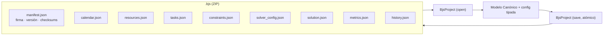

# Anatomía del contenedor `.bjs`

El `.bjs` es el **contrato de datos oficial**: un contenedor ZIP (DEFLATE) con
JSON aislados por *concern*. Es portable, íntegro (checksums), versionable con Git
y da al motor independencia total de bases de datos externas.



## Piezas

| Archivo | Contenido | Se interpreta como |
|---|---|---|
| `manifest.json` | UUID, `format_version`, firma del motor, sellos de tiempo, **checksums SHA-256** | metadatos + integridad |
| `calendar.json` | rejilla canónica (segmentos) | `TimeGrid` |
| `resources.json` | recursos con *tags* | `Resource[]` |
| `tasks.json` | tareas y requisitos | `Task[]` |
| `constraints.json` | reglas activas, tier, peso, params | `PluginsConfig` |
| `solver_config.json` | solver, hilos, tiempo, semilla | `EngineConfig` |
| `solution.json` | último horario (opcional) | `Solution` |
| `metrics.json` | KPIs del horario | dict |
| `history.json` | corridas anteriores | lista |

El problema canónico se **parte** en `calendar`/`resources`/`tasks` para que los
diffs de Git sean limpios y legibles.

## Garantías

- **Escritura atómica.** `save` serializa el ZIP en memoria y lo renombra con
  `os.replace` (atómico en el mismo volumen). Un corte de energía o un `Ctrl+C`
  **nunca** deja un `.bjs` a medio escribir.
- **Integridad.** Al abrir se verifican los checksums; un archivo manipulado falla
  con un error claro.
- **Git-friendly.** `project extract` escribe cada JSON con `sort_keys` e indent 2,
  de forma determinista (dos *extract* del mismo `.bjs` son byte-idénticos).
- **Migración.** El `manifest` lleva `format_version`; un migrador encadenable hace
  *upcast* en memoria para que el formato dure décadas.

## Reparto por capas

El **contenedor crudo** (ZIP, checksums, atomicidad) vive en `serialization/bjs.py`
(Core, solo dicts). El **proyecto tipado** (`BjsProject`, que conoce la config)
vive en `application/project.py`. Así el Core no depende de la capa de aplicación.

## Operar el contenedor

```bash
schedule-engine project info    colegio.bjs
schedule-engine project validate colegio.bjs --strict
schedule-engine project extract colegio.bjs --out ./src/
schedule-engine project pack    ./src/ --out colegio2.bjs
```

Justificación completa en **ADR-025** y **ADR-028**
([índice de decisiones](decisions.md)).
