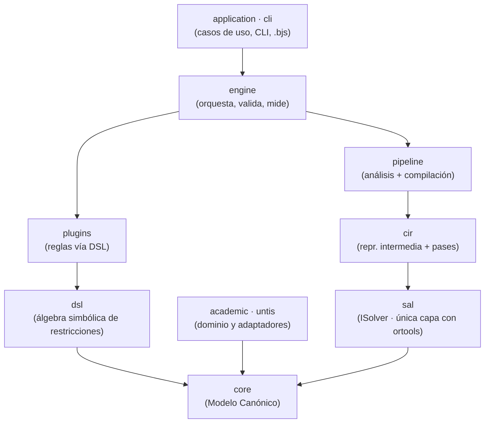

# Visión general de la arquitectura

El motor está organizado en **capas con dependencias solo hacia abajo**. El
dominio (qué es un docente, un aula, una clase) no sabe nada del solver
matemático; el solver no sabe nada de colegios. Entre ambos hay una cadena de
traducciones explícitas y verificables.

## Capas

- **`core`** — el **Modelo Canónico**: `Resource`, `Task`, `TimeGrid`, `Solution`.
  Entidades genéricas identificadas por *tags* (`teacher`, `room`, `group`…), sin
  vocabulario escolar.
- **`academic` / `untis`** — el dominio concreto (docentes, aulas, cargas; import
  de Untis) y los **adaptadores** que lo traducen al canónico.
- **`dsl`** — álgebra simbólica para expresar restricciones (`LinearExpr`,
  `Relation`, `NoOverlap`) sin conocer el solver.
- **`cir`** — *Constraint Intermediate Representation*: el DSL bajado a una forma
  optimizable, con **Optimizer Passes** (dedup, simplificación) al estilo LLVM.
- **`sal`** — *Solver Abstraction Layer*: la interfaz `ISolver`. **Es la única
  capa que importa `ortools`.**
- **`plugins`** — las reglas de negocio (Rule Engine + Scoring Engine) como
  plugins que declaran DSL; nunca tocan el solver.
- **`pipeline` / `engine`** — orquestan el análisis de factibilidad, la
  compilación y la resolución, y reconstruyen/validan/miden la solución.
- **`application` / `cli`** — la Capa de Aplicación (patrón Command, formato
  `.bjs`) y la CLI `schedule-engine`. Son **clientes** del motor.

## La regla de oro, verificada por tests

!!! quote "Una sola línea `import ortools`"
    En todo el repositorio hay exactamente **una** importación de `ortools`, en
    `sal/ortools_solver.py`. `tests/test_architecture.py` recorre el árbol y falla
    si alguna otra capa la introduce, o si el Core importa la capa de aplicación.

Esto mantiene el dominio **agnóstico del solver**: cambiar CP-SAT por un backend
MILP (CBC, SCIP, HiGHS) es implementar otra `ISolver`, sin tocar el dominio (ver
[Guía: solvers](../sdk_guide/solvers.md)).

## Por qué esta forma

- **Sustituibilidad**: cada frontera es una interfaz pequeña; el solver, los
  importadores y las reglas se reemplazan sin efecto dominó.
- **Testabilidad**: el `FakeSolver` permite probar el pipeline sin OR-Tools; las
  reglas se prueban con un contrato (`assert_plugin_contract`).
- **Escala**: la formulación compacta por intervalos (ADR-015) hace viable
  instituciones de cientos de docentes.

Las decisiones que fijaron esta arquitectura están en el
[índice de ADR](decisions.md).
