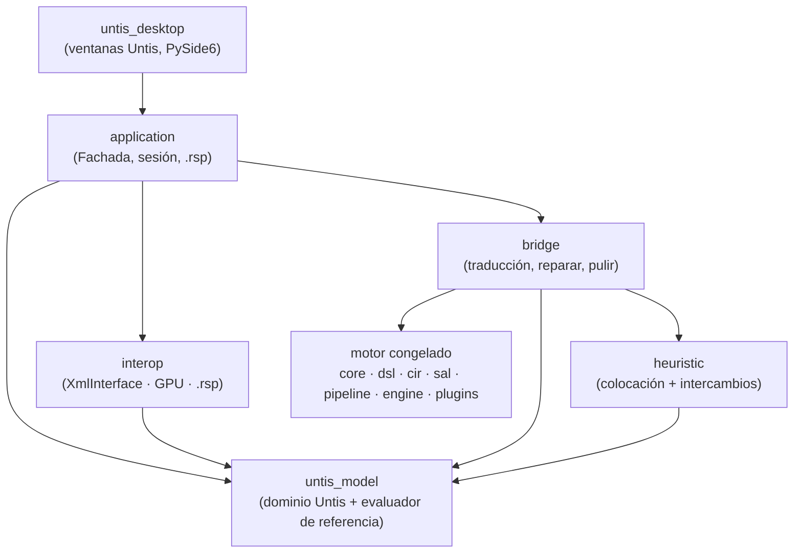

# Visión general de la arquitectura

RealSchool se reorganizó en torno al **dominio Untis** (ADR-034). El producto es
el cliente de escritorio y el formato de proyecto; el motor genérico de
calendarización queda **congelado** en la etiqueta `engine-1.0` como librería
interna. Las dependencias van siempre hacia abajo.

## Capas

```mermaid
graph TD
    UI["untis_desktop<br/>(ventanas Untis, PySide6)"] --> APP["application<br/>(Fachada, sesión, .rsp)"]
    APP --> DOM["untis_model<br/>(dominio Untis + evaluador de referencia)"]
    APP --> IO["interop<br/>(XmlInterface · GPU · .rsp)"]
    APP --> BR["bridge<br/>(traducción, reparar, pulir)"]
    IO --> DOM
    BR --> DOM
    BR --> HEU["heuristic<br/>(colocación + intercambios)"]
    HEU --> DOM
    BR --> ENG["motor congelado<br/>core · dsl · cir · sal · pipeline · engine · plugins"]
```

- **`untis_model`** — entidades Untis inmutables: rejillas por sección, clases,
  profesores, aulas, materias, grupos de alumnos, lecciones con **acoples
  explícitos** (el nº de lección manda), deseos −3…+3, ponderación de 9
  pestañas 0–5 y horarios. Incluye el **evaluador de referencia**
  (`evaluation.py`, ADR-035): el número de evaluación y su desglose por
  criterio, en períodos. No importa nada del resto del proyecto.
- **`interop`** — un modelo, varios serializadores: XmlInterface (lectura y
  escritura, 100 % de campos), GPU001–007/016 (lectura tolerante, escritura
  cp1252), `.rsp` (ZIP con un JSON por entidad y manifest versionado) y el
  convertidor legado `.bjs`.
- **`bridge`** — el **único** traductor al motor. Reloj común de minutos para
  medir choques reales entre rejillas con horas distintas; reconstrucción de
  horarios; **Reparar** (CP-SAT con cambio mínimo sobre un subproblema de
  ventana) y **Pulir** (CP-SAT por clase, aceptado solo si el evaluador de
  referencia mejora), con los criterios Untis como plugins propios (ADR-036).
- **`untis_desktop`** — la aplicación PySide6: cinta, área MDI y paneles; cada
  ventana se registra sola (`registry.py`) y solo habla con la Fachada a través
  del puente Qt (`qt_bridge.py`), que agrupa refrescos, sincroniza la selección
  entre ventanas y optimiza en un hilo sobre una instantánea. Idiomas es/de con
  `QTranslator`.
- **`application.untis`** — la Fachada: `UntisService` sin estado sobre una
  `UntisSession` con deshacer/rehacer; ediciones que devuelven `EditResult`.
- **`heuristic`** — generación desde cero (fases 1 y 2 de Untis): colocación
  por dificultad e intercambios con evaluación incremental. No ve el motor.
- **motor congelado** — el Modelo Canónico (`core`), el DSL, la CIR con sus
  pases, la SAL (única capa que importa `ortools`), el pipeline con explicación
  de conflictos y el `engine` con validación, métricas (con desglose por
  criterio) y reoptimización.

## Fronteras verificadas por tests

`tests/test_boundaries.py` analiza los imports por AST (resuelve imports
relativos, ignora docstrings) y exige:

1. `untis_model` no importa nada de `scheduling_platform`.
2. `interop` solo importa `untis_model` (salvo `bjs_legacy`).
3. `heuristic` solo importa `untis_model`.
4. Fuera del motor, solo `bridge` importa el motor. Las capas legadas que aún lo
   hacen están en una lista que **solo puede encoger**.
5. El motor congelado nunca importa capas de producto.
6. `untis_desktop` solo importa `scheduling_platform.application`.

Se mantienen además las reglas históricas: una sola línea `import ortools`, en
`sal/ortools_solver.py` (`tests/test_architecture.py`).

## El juez

El `ValidationEngine` del motor es el juez independiente de las duras; el
evaluador de referencia lo es del número de evaluación. Sobre el horario
publicado por Untis, ambos y un barrido directo del reloj de pared ven los
mismos 7 choques reales y ninguno más: la traducción no inventa ni oculta nada.
