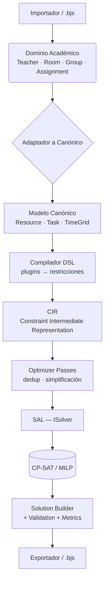

# El pipeline: del dato al horario y de vuelta

Este es el viaje completo de los datos, desde que se importan hasta que se
guarda el horario optimizado en un `.bjs`.

## Etapa por etapa

1. **Importación → Dominio.** Un adaptador (`untis/`, `academic/`, o el que
   escribas — ver [importadores](../sdk_guide/importers.md)) produce entidades del
   dominio o directamente el canónico.
2. **Adaptador → Modelo Canónico.** `AcademicToCanonicalAdapter` traduce docentes,
   aulas y cargas a `Resource`/`Task` con *tags*, y el marco horario a una
   `TimeGrid` de segmentos (un segmento por día). Untis va directo a canónico
   (con acoples y minutos-reloj reales).
3. **Análisis de factibilidad (pre-solver).** El `ConstraintGraphBuilder` detecta
   imposibilidades estructurales (un requisito sin recurso, demanda que no cabe) y
   las **explica** en vez de devolver un `INFEASIBLE` mudo.
4. **Compilación DSL → CIR.** Los plugins activos declaran restricciones en el DSL
   (`LinearConstraint`, `NoOverlap`, …); el *lowering* las baja al **CIR** y los
   **Optimizer Passes** lo simplifican (deduplican restricciones y variables).
5. **Solver Compiler → SAL.** El CIR se instancia en un `ISolver` concreto a
   través de la SAL. Es la **única** frontera que habla con OR-Tools.
6. **Búsqueda.** El solver resuelve (CP-SAT por defecto; CBC/SCIP/HiGHS vía
   `MipSolver`). Se pueden sembrar soluciones conocidas (*warm start*).
7. **Reconstrucción y verificación.** El `SolutionBuilder` reconstruye el horario
   desde las variables; el `ValidationEngine` lo re-verifica de forma independiente
   del solver; el `MetricsEngine` calcula sus KPIs.
8. **Exportación.** El horario se serializa (JSON/YAML) y se guarda en el `.bjs`
   de forma atómica.

## Telemetría y progreso

Cada etapa se cronometra en una `Telemetry` (latencias, tamaño del modelo, ramas y
conflictos del solver). Un *hook* opcional `on_event` emite
[eventos de progreso](../sdk_guide/telemetry.md) en vivo (`--json-stream`), sin
cambiar el comportamiento por defecto.

## Dónde engancharte

| Quiero… | Implemento… | Guía |
|---|---|---|
| Añadir una regla | `SchedulingPlugin` | [Restricciones](../sdk_guide/constraints.md) |
| Leer un formato nuevo | un adaptador → canónico | [Importadores](../sdk_guide/importers.md) |
| Escribir un formato | un exportador | [Exportadores](../sdk_guide/exporters.md) |
| Usar otro solver | `ISolver` | [Solvers](../sdk_guide/solvers.md) |
