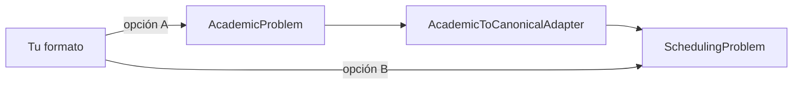

# Crear importadores (adaptadores de dominio)

Un importador traduce un formato externo (Untis XML, CSV, una base de datos…) al
**Modelo Canónico** (`SchedulingProblem`) o al **dominio académico**
(`AcademicProblem`, que un adaptador convierte a canónico).

## Dos caminos



- **Opción A (recomendada para datos escolares):** construye un `AcademicProblem`
  (docentes, aulas, grupos, cargas) y reutiliza `AcademicToCanonicalAdapter`. Ganas
  la validación de integridad referencial gratis (IDs únicos, referencias válidas).
- **Opción B (como Untis):** si tu formato trae estructuras que no encajan en el
  marco académico uniforme (acoples, minutos-reloj), traduce **directo a canónico**.

## Patrón (Opción A)

```python
from scheduling_platform.academic import (
    AcademicProblem, Teacher, Room, StudentGroup, Subject,
    TeachingAssignment, TimeFrame, AcademicToCanonicalAdapter,
)
from scheduling_platform.academic.ids import (
    TeacherId, RoomId, GroupId, SubjectId, AssignmentId,
)

def import_from_myformat(data) -> AcademicProblem:
    return AcademicProblem(
        time_frame=TimeFrame(day_names=("Lun", "Mar", "Mié", "Jue", "Vie"),
                             periods_per_day=7),
        rooms=(Room(RoomId(0), "Aula 1", capacity=30),),
        teachers=(Teacher(TeacherId(0), "Docente A"),),
        groups=(StudentGroup(GroupId(0), "10A", size=26),),
        subjects=(Subject(SubjectId(0), "Matemáticas"),),
        assignments=(TeachingAssignment(
            AssignmentId(0), TeacherId(0), SubjectId(0), GroupId(0),
            session_lengths=(1, 1),
        ),),
    )

problem = AcademicToCanonicalAdapter().translate(import_from_myformat(data)).problem
```

## Integrarlo en el CLI

El comando `convert` (en `application/commands/convert.py`) instancia el adaptador
adecuado según la extensión del origen y empaqueta el resultado en un `.bjs`.
Añadir un formato = añadir una rama que instancie **tu** importador. El patrón de
Untis (`untis/parser.py` + `untis/adapter.py`) es la plantilla completa de un
importador de producción.

## Probarlo

- Round-trip: importa → `problem_to_dict` → compara con lo esperado.
- Integridad: `AcademicProblem.__post_init__` ya rechaza referencias colgantes;
  añade casos negativos (un docente inexistente en una carga).
- Con datos reales: `tests/test_untis.py` valida contra los XML del Colegio Alemán.

Referencia: [API — application](../reference/application.md) ·
[core](../reference/core.md).
