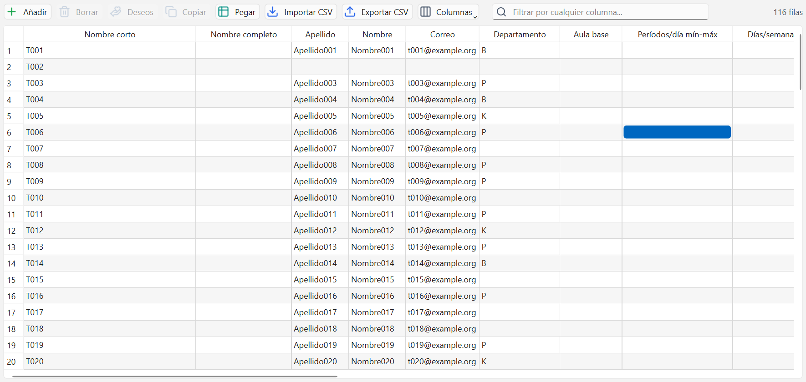
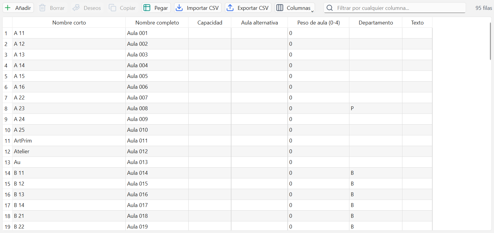
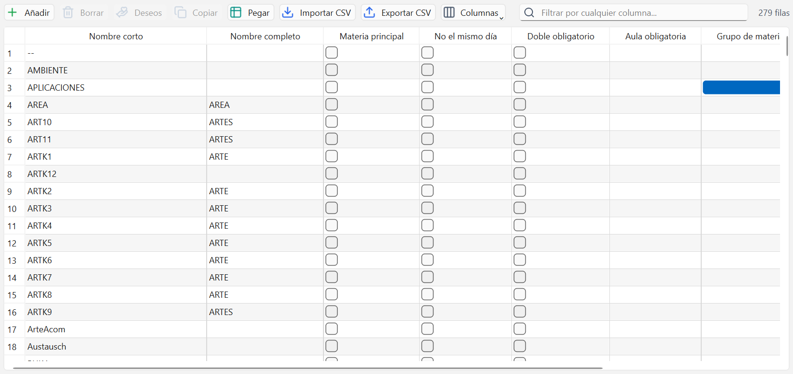
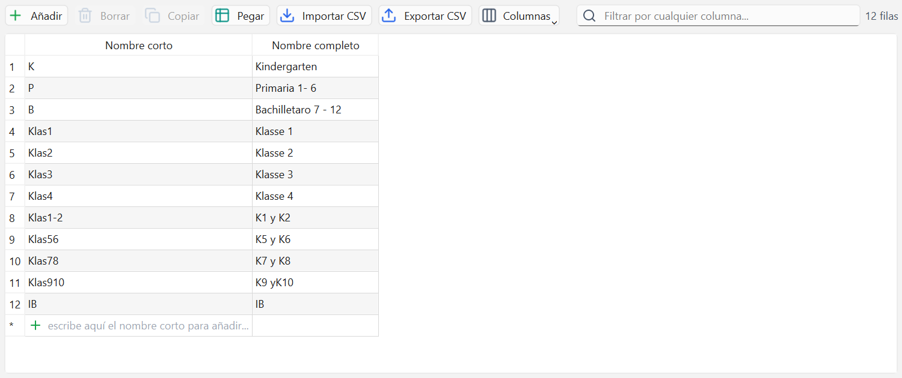
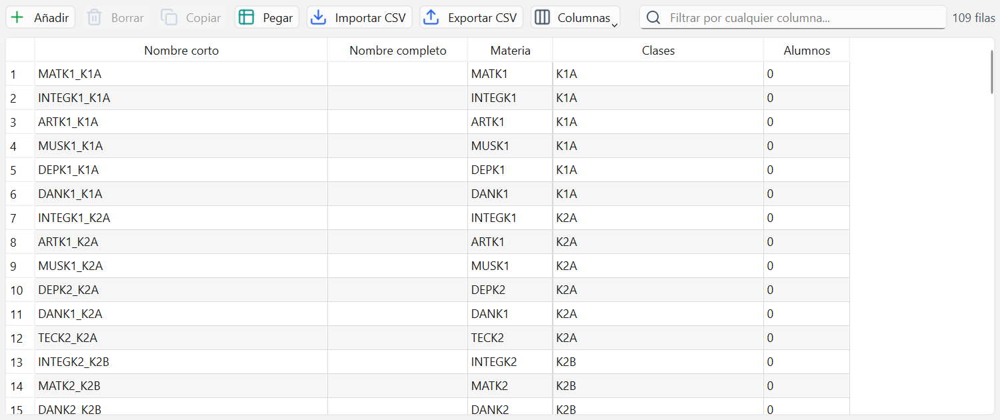
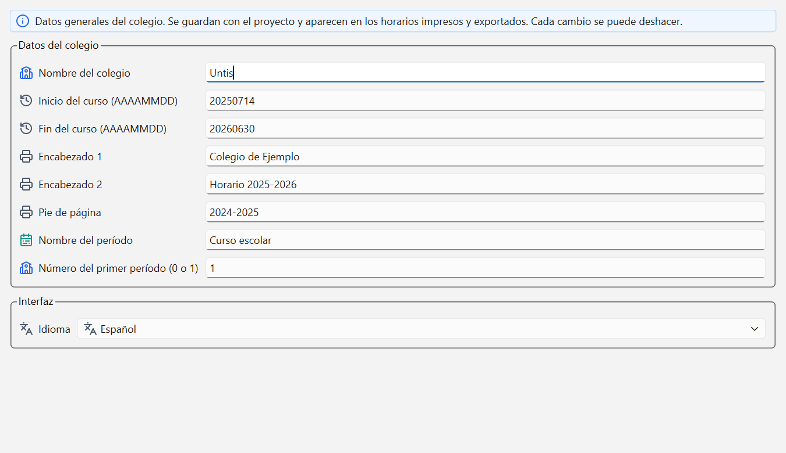

# Datos maestros

Los datos maestros son la lista de lo que existe en el colegio: clases, profesores, aulas,
materias, departamentos y grupos de alumnos. Todo lo demás se apoya en ellos.

## Seis cuadrículas iguales

Hay una ventana por cada tipo, y las seis funcionan igual: una tabla que se edita como una hoja
de cálculo. Solo cambian las columnas.

La barra de arriba es siempre la misma: **Añadir**, **Borrar**, **Deseos**, **Copiar**, **Pegar**,
**Importar CSV**, **Exportar CSV** y **Columnas**, más el filtro "Filtrar por cualquier
columna..." y, a la derecha, cuántas filas hay ("66 filas"; con el filtro puesto, "12 de 66
filas"). El botón **Deseos** solo aparece en Clases, Profesores, Aulas y Materias, que son las
que tienen deseos de tiempo.

La primera columna es siempre el **Nombre corto**. Es el nombre que sale impreso en los horarios
y el que usan las lecciones para referirse a la fila, así que no se puede repetir ni dejar vacío.

## Añadir y borrar filas

1. Pulsa **Añadir**, o baja hasta la última fila, la que dice "escribe aquí el nombre corto para
   añadir...".
2. Escribe el nombre corto y pulsa Intro. La fila queda creada.
3. Completa las demás columnas escribiendo directamente en cada celda. Las columnas que apuntan a
   otra ventana (Rejilla, Aula base, Profesor tutor, Departamento, Materia...) se editan con un
   desplegable; la opción vacía quita la referencia.

Para borrar, selecciona la fila y pulsa **Borrar** (o la tecla Supr). Si algo la usa, no se borra
y se explica dónde: "'MAT' se usa en 12 lección(es): 3, 14, 27...". Cámbiale la materia a esas
lecciones y vuelve a intentarlo. Borrar se puede deshacer con Ctrl+Z.

## Clases

- **Rejilla**: la rejilla de tiempo por la que se rige la clase. Es lo que decide a qué horas
  puede tener clase ese curso. Ver [Rejillas de tiempo](03-rejillas-de-tiempo.md).
- **Aula base**: el aula propia del curso, donde se dan las materias que no piden otra cosa.
- **Profesor tutor**: el director de grupo de la clase.
- **Departamento**: sirve para filtrar y ordenar por etapa o por edificio.
- **Alumnos** y **Nivel**: cuántos alumnos tiene y en qué curso está.
- **Períodos/día mín-máx** y **Almuerzo mín-máx**: se escriben como `4-7`. Un solo número (`6`)
  vale como mínimo y máximo a la vez; en blanco significa "sin límite".
- **Mat. principales/día** y **Mat. principales seguidas**: cuántas materias marcadas como
  principales acepta al día y cuántas seguidas.
- **Texto**: nota libre.

## Profesores

- **Nombre corto**: tres o cuatro letras, fáciles de reconocer. Es lo que se ve en los horarios.
- **Nombre completo**, **Apellido**, **Nombre**, **Correo**: los datos de la persona.
- **Departamento** y **Aula base**.
- **Períodos/día mín-máx**, **Días/semana máx**, **Períodos seguidos máx**: cuánto puede trabajar.
- **Huecos/día mín-máx** y **Huecos/semana mín-máx**: las horas libres entre clases que se le
  toleran.
- **Almuerzo mín-máx**: cuántas horas libres necesita al mediodía.
- **Guardias: minutos/semana máx**: cuántos minutos de vigilancia de recreo se le pueden asignar
  a la semana. Un 0 lo deja fuera del reparto de guardias.
- **Reserva para sustituir (0-9)**: cuanto más alto, menos se le propone como sustituto cuando
  falta un compañero. Un 0 significa que está disponible como cualquier otro.
- **Situación**, **Nº de nómina**, **Género**, **Texto**: datos administrativos.

## Aulas

- **Capacidad**: cuántos alumnos caben.
- **Aula alternativa**: el aula que se usa si esta está ocupada. Se pueden encadenar: A apunta a
  B y B apunta a C.
- **Peso de aula (0-4)**: cuánto molesta no conseguir el aula pedida. Con 0 da igual; con 4 es
  casi obligatoria.
- **Departamento** y **Texto**.

Las aulas son opcionales: una lección que no pide aula se coloca sin tenerla en cuenta.

## Materias

- **Materia principal**: casilla. Las principales prefieren la mañana y tienen un máximo por día.
- **No el mismo día**: casilla. Sus horas no se juntan en la misma jornada.
- **Doble obligatorio**: casilla. Siempre en bloques de dos horas seguidas.
- **Aula obligatoria**: el laboratorio, el gimnasio o el aula de informática que necesita.
- **Grupo de materias**: agrupa materias parecidas.
- **Color de texto** y **Color de fondo**: el color con el que la materia se pinta en los horarios
  y en el Diálogo de planificación.

Las casillas de sí/no también se pueden escribir: vale `x`, `si`, `1` para marcarlas y dejarlo en
blanco o `no` para quitarlas.

## Departamentos

Solo tienen **Nombre corto** y **Nombre completo**. Agrupan profesores, clases y aulas para poder
filtrar y ordenar. Son opcionales: un colegio pequeño puede no usarlos. Eso sí, si se van a usar,
conviene crearlos antes que el resto, porque las otras cuadrículas los nombran.

## Grupos de alumnos

Un grupo de alumnos es una parte de una clase que se separa en algunas materias: desdobles,
optativas, religión o valores. Columnas: **Materia**, **Clases** (varias separadas por comas) y
**Alumnos**. Se usa en la línea de una lección para decir que solo asiste una parte de la clase.

## Validación: las celdas en rojo

Cada valor se comprueba al escribirlo. Si no vale, la celda queda en rojo y el motivo sale al
pasar el ratón por encima y en la franja de aviso de abajo. Los casos típicos:

- un nombre corto repetido o vacío;
- un número fuera de rango, como un peso de aula de 7 o una reserva para sustituir de 12;
- una referencia que no existe: "la rejilla 'Primaria' no existe: créala antes en Datos maestros
  -> Rejillas de tiempo".

El aviso siempre dice qué hay que dar de alta antes y dónde.

## Mostrar, ocultar y reordenar columnas

Las cuadrículas traen muchas columnas y casi ningún colegio las usa todas.

1. Pulsa **Columnas** (o haz clic derecho en la cabecera de la tabla).
2. Marca y desmarca las columnas que quieres ver. La del nombre corto no se puede ocultar.
3. Para cambiar el orden, arrastra la cabecera de una columna a otro sitio.
4. Para cambiar el ancho, arrastra el borde entre dos cabeceras.
5. **Restablecer columnas**, al final del menú, vuelve a mostrarlas todas en su orden original.

La disposición se guarda por ventana y sigue igual la próxima vez que se abre el programa. Ojo:
al copiar filas se copian solo las columnas visibles y en el orden en que se ven.

## Datos del colegio

No es una cuadrícula, pero se trabaja al mismo tiempo. Guarda el nombre del colegio, las fechas
del curso y los textos que salen impresos en los horarios.

Las fechas se escriben con el formato AAAAMMDD, por ejemplo `20260901`. **Encabezado 1**,
**Encabezado 2** y **Pie de página** son los textos que aparecen en cada horario impreso. Abajo,
**Idioma** cambia el idioma de toda la interfaz.

## Errores frecuentes

- **"'ANA' ya existe".** Dos filas con el mismo nombre corto no son posibles. Si hay dos profesores
  que se llaman igual, distíngueles el nombre corto (ANA1 y ANA2) y usa el nombre completo para
  el nombre real.
- **No puedo borrar una clase.** El aviso dice en cuántas lecciones se usa. Borra o reasigna esas
  lecciones primero; el programa nunca borra algo que está en uso.
- **Perdí una columna y no la encuentro.** No se borró, está oculta. Pulsa **Columnas** y vuelve a
  marcarla, o usa **Restablecer columnas**.
- **Escribí `4 a 7` en Períodos/día y quedó en rojo.** Los rangos se escriben con guion: `4-7`.
