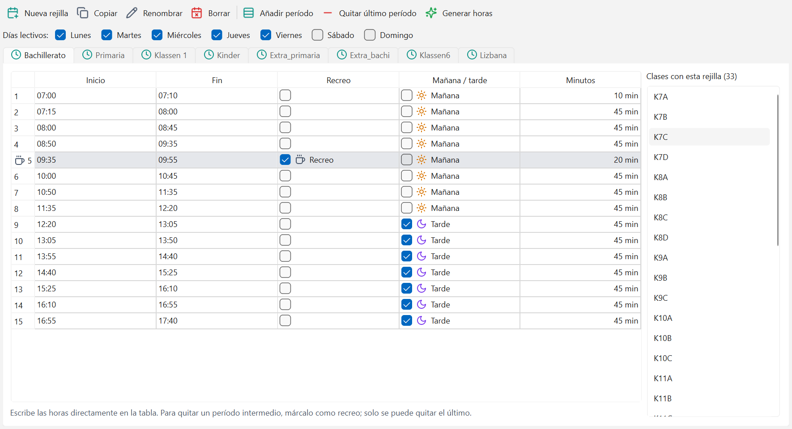

# Rejillas de tiempo

Una rejilla de tiempo dice cuándo hay clase: qué días de la semana, cuántos períodos al día, a
qué hora empieza y termina cada uno y cuáles son recreos. Todo el horario se coloca encima.

## Qué se ve en la ventana

- Arriba, la barra de órdenes: **Nueva rejilla**, **Copiar**, **Renombrar**, **Borrar**,
  **Añadir período**, **Quitar último período** y **Generar horas**.
- Debajo, **Días lectivos:** con una casilla por día, de lunes a domingo.
- Una pestaña por rejilla (en el ejemplo: Bachillerato, Primaria, Klassen 1, Kinder...).
- La tabla de la rejilla abierta, con una fila por período y las columnas **Inicio**, **Fin**,
  **Recreo**, **Mañana / tarde** y **Minutos**.
- A la derecha, **Clases con esta rejilla (33)**: qué cursos se rigen por ella.

Los recreos se ven en gris, con el icono de la taza y la palabra "Recreo".

## Por qué cada clase apunta a una rejilla

Casi ningún colegio tiene una sola jornada: Primaria sale antes que Bachillerato, y el preescolar
tiene otro horario. Por eso cada clase lleva una columna **Rejilla** en
[Datos maestros](02-datos-maestros.md), y esa rejilla es la que decide a qué horas puede tener
clase ese curso.

Un proyecto nuevo trae una sola rejilla, llamada "Estándar". Si todo el colegio tiene la misma
jornada, basta con ajustarla. Si hay etapas con horarios distintos, se crea una rejilla por etapa
y se le asigna a sus clases desde la columna Rejilla de la ventana Clases.

## Crear una rejilla

1. Pulsa **Nueva rejilla**.
2. En **Nombre** escribe un nombre corto (por ejemplo Primaria, Tarde o Bachillerato). Es el
   nombre por el que las clases la eligen.
3. Marca los **Días lectivos**.
4. Indica **Períodos de clase** (cuántos hay al día, sin contar recreos), **Primera clase empieza
   a las**, **Duración de cada período** y **Cambio de clase** (los minutos entre el final de un
   período y el inicio del siguiente).
5. En **Recreos**, pulsa **Añadir recreo** y di tras qué período va y cuántos minutos dura.
   **Quitar** elimina el recreo de esa línea.
6. Mira la **Vista previa de las horas**: la tabla muestra el número, el horario y el tipo de cada
   período (Mañana, Tarde o Recreo). Si algo no cuadra, el aviso lo dice antes de crear nada.
7. Pulsa **Crear rejilla**.

## Copiar, renombrar y borrar

- **Copiar** duplica la rejilla abierta. Pide el nombre corto de la copia y propone
  "Bachillerato (copia)". Es lo más rápido cuando dos etapas tienen horarios parecidos.
- **Renombrar** cambia el nombre completo de la rejilla. El nombre corto no cambia, porque es el
  que usan las clases y las lecciones para apuntar a ella.
- **Borrar** pide confirmación y solo funciona si ninguna clase ni lección la usa.

## Los días de la semana

Marca o desmarca las casillas de **Días lectivos**. El cambio afecta solo a la rejilla abierta,
así que se puede tener Bachillerato de lunes a viernes y otra rejilla que incluya el sábado.

Si ya hay un horario generado y se quiere quitar un día que tiene clases colocadas, el programa
no lo permite: "Hay clases colocadas en los días que quieres quitar; desprográmalas antes."

## Añadir y quitar horas

- **Añadir período** añade uno al final de la jornada, con la misma duración que el anterior.
- **Quitar último período** quita el último, y solo el último. Los números de período son la
  dirección de las clases ya colocadas, así que quitar uno del medio las movería todas de sitio:
  "Solo se puede quitar el último período; para uno intermedio, márcalo como recreo."
- Una rejilla no puede quedarse sin períodos, y un período con clases colocadas no se quita:
  "Hay clases colocadas en ese período; desprográmalas antes."

## Generar las horas de golpe

**Generar horas** vuelve a calcular toda la jornada a partir de la hora de inicio, la duración,
el cambio de clase y los recreos. Pide los mismos datos que **Nueva rejilla** y enseña la misma
vista previa; el botón de confirmar se llama **Generar**.

Es la forma rápida de arreglar un horario que se armó mal desde el principio. Solo funciona con
rejillas sin clases colocadas; si ya se generó el horario, el aviso dice: "La rejilla tiene clases
colocadas: edita las horas período a período."

## Retocar un período concreto

Escribe la hora directamente en la tabla, en las columnas **Inicio** o **Fin**, con el formato
`HH:MM` (por ejemplo `07:15`). La columna **Minutos** se recalcula sola: es lo que dura el
período.

La columna **Mañana / tarde** marca a qué mitad del día pertenece el período. Eso es lo que usan
los deseos de "mañanas libres" y "tardes libres" y los criterios de reparto de la semana.

## Marcar una hora como recreo

Marca la casilla de la columna **Recreo** en esa fila. El período sigue existiendo y ocupando su
lugar en el reloj, pero queda cerrado: ahí no se coloca ninguna clase y en la ventana de deseos
aparece en gris, sin poder pintarse.

Es también el truco para quitar de en medio una hora intermedia sin renumerar toda la jornada.

## Errores frecuentes

- **"La rejilla 'Primaria' la usan 18 clase(s) y 240 lección(es); cámbiales la rejilla antes."**
  No se borra una rejilla en uso. Ve a Clases, cambia la columna Rejilla de esos cursos y vuelve.
- **Cambié la hora de inicio y las demás no se movieron.** Editar una celda cambia solo ese
  período. Para recalcular la jornada entera usa **Generar horas**.
- **Falta una hora al final del día.** Usa **Añadir período**; luego ajusta su Inicio y Fin en la
  tabla si la duración no es la misma que la del resto.
- **Las clases de Primaria salen a horas de Bachillerato.** Esas clases están apuntando a la
  rejilla equivocada. Se arregla en la columna Rejilla de [Datos maestros](02-datos-maestros.md).
