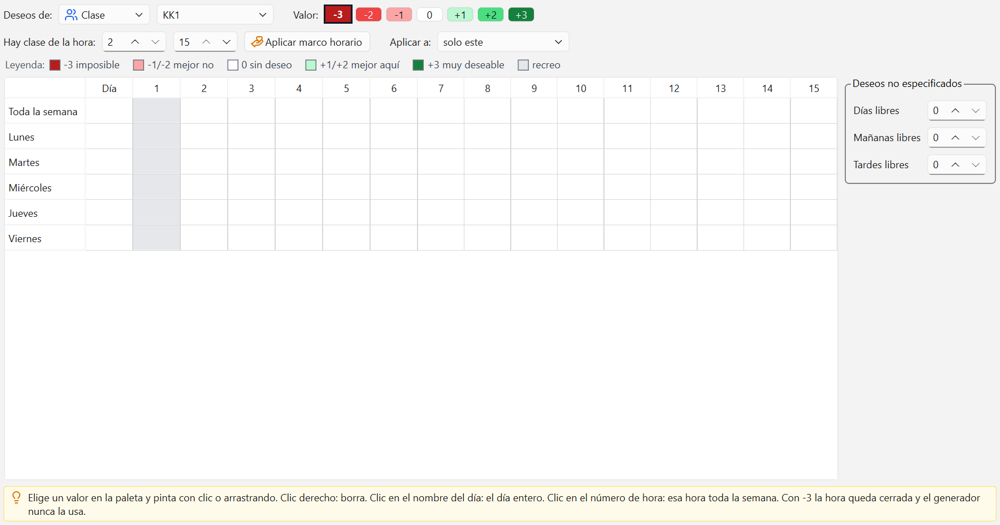

# Deseos de tiempo y marco horario

Los deseos de tiempo dicen en qué horas un profesor, una clase, un aula o una materia no puede o
prefiere no tener clase, y en cuáles sí. El marco horario cierra de una vez las horas en que ese
curso no tiene jornada.

## Qué se ve en la ventana

- **Deseos de:** elige el tipo (Clase, Profesor, Aula o Materia) y, al lado, la entidad concreta.
- **Valor:** la paleta de -3 a +3. El botón marcado es el que pinta el clic.
- **Hay clase de la hora:** los dos selectores del marco horario y el botón **Aplicar marco
  horario**.
- **Aplicar a:** a quién afecta lo que haces: "solo este", "todos los de su rejilla" o "todos".
- La **Leyenda** de colores y, debajo, la cuadrícula: una fila por día y una columna por hora.
- A la derecha, el cuadro **Deseos no especificados**.

Si eliges una clase o un profesor en [Datos maestros](02-datos-maestros.md) y pulsas **Deseos**,
esta ventana se abre ya centrada en esa fila.

## La escala de -3 a +3

| Valor | Qué significa |
| --- | --- |
| -3 | Imposible, nunca aquí |
| -2 | Muy poco deseable |
| -1 | Poco deseable |
| 0 | Sin deseo (borra el valor) |
| +1 | Deseable |
| +2 | Bastante deseable |
| +3 | Muy deseable |

Hay una diferencia importante entre el -3 y todo lo demás. **El -3 es lo único obligatorio**: esa
hora queda cerrada y el generador nunca la usa, pase lo que pase. Del -2 al +3 son preferencias:
el programa intenta respetarlas y, si no puede, coloca la clase igual y lo anota como un defecto
del horario, que luego se ve en la Evaluación.

## Pintar celdas

1. Elige el tipo y la entidad.
2. Pulsa el valor en la paleta.
3. Haz clic en una celda, o arrastra por varias, para pintarlas con ese valor.
4. El clic derecho borra: deja las celdas en 0, sin deseo.

Los recreos se ven en gris y no se pueden pintar: ahí no hay clase de todos modos.

## Un día entero y una hora de toda la semana

- **Clic en el nombre del día** (Lunes, Martes...): el deseo se aplica al día completo. Es lo que
  se usa para el día libre de un profesor.
- **Clic en el número de la hora** (1, 2, 3...): el deseo se aplica a esa hora todos los días. Es
  lo que se usa para cerrar la primera hora o las últimas de la tarde.

Las dos cosas se ven también dentro de la cuadrícula: la columna **Día** es el deseo del día
entero y la fila **Toda la semana** es el deseo de cada hora en toda la semana.

## El marco horario

El marco horario responde a una pregunta sencilla: de qué hora a qué hora hay clase. Es lo primero
que conviene hacer, antes de pintar nada a mano.

1. En **Hay clase de la hora:** pon la primera y la última hora en que ese curso tiene jornada.
2. Elige en **Aplicar a:** a quién se lo pones.
3. Pulsa **Aplicar marco horario**.

Todas las horas que quedan fuera del marco se cierran con -3, todos los días. Así se dice que
Primaria termina a la séptima hora aunque su rejilla llegue a la decimoquinta.

## El selector "Aplicar a"

Un colegio con 66 clases y 15 horas al día tiene cientos de celdas que pintar. El selector
**Aplicar a:** evita ese trabajo. Vale tanto para el marco horario como para lo que se pinta con
la paleta:

- **solo este**: afecta únicamente a la clase o al profesor que estás viendo.
- **todos los de su rejilla**: afecta a todos los que comparten su misma rejilla de tiempo. Es la
  opción normal para el marco horario: todos los cursos de Primaria terminan a la misma hora.
- **todos**: afecta a todas las clases (o a todos los profesores, según el tipo elegido).

Ponlo de nuevo en "solo este" antes de seguir con los deseos personales de alguien, o se los
pondrás a todo el colegio.

## Deseos no especificados

El cuadro de la derecha guarda los deseos que no dicen cuándo, solo cuántos:

- **Días libres**: cuántos días enteros libres quiere a la semana, sin decir cuáles.
- **Mañanas libres** y **Tardes libres**: lo mismo con las medias jornadas.

Sirven para el profesor de medio tiempo que necesita dos días libres pero le da igual cuáles: así
el generador elige los que mejor le convengan al horario. Un 0 quita el deseo.

## Consejos de uso

- **No abuses del -3.** Cada hora cerrada es una hora menos donde colocar clases. Con demasiados
  -3 el horario se vuelve imposible y quedan períodos sin colocar.
- Para lo que molesta pero se puede aceptar, usa -1 o -2. El generador los tendrá en cuenta y, si
  no le queda otra, podrá saltárselos.
- Empieza siempre por el marco horario con "todos los de su rejilla", y solo después pinta los
  casos particulares.
- Deja los deseos para el final, cuando la rejilla, los datos maestros y las lecciones ya estén.
  Es más fácil ver qué margen hay.

## Errores frecuentes

- **"La primera hora es posterior a la última".** Los dos selectores del marco horario están al
  revés: la primera hora tiene que ser menor o igual que la última.
- **"Elige una entidad".** No hay ninguna clase ni profesor seleccionado en el desplegable de al
  lado, normalmente porque el proyecto todavía no tiene datos maestros.
- **"'6A' no tiene rejilla de tiempo".** Esa clase no apunta a ninguna rejilla, así que el
  programa no sabe cuántas horas tiene su jornada. Rellena la columna Rejilla en Clases.
- **Puse un marco horario y se lo llevó todo el colegio.** El selector **Aplicar a:** estaba en
  "todos". Pulsa Ctrl+Z: el cambio entero se deshace de una vez.
- **Quedaron clases sin colocar tras generar.** Suele ser exceso de -3. Revisa los profesores con
  la semana casi toda en rojo y suaviza lo que no sea realmente imposible.
