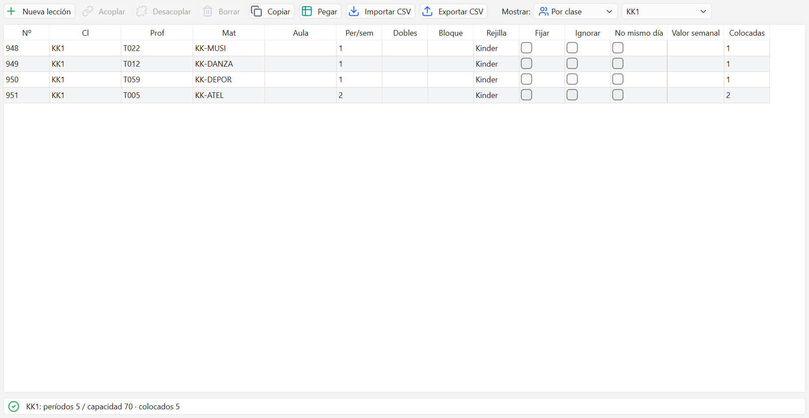

# Lecciones

Aquí se dice qué se enseña: cada lección une una materia, un profesor y una o varias clases
con un número de horas por semana. Es la ventana de datos más importante: sin lecciones no hay
horario que generar.

## Qué es una lección

Una lección responde a cuatro preguntas: qué materia, quién la da, quién la recibe y cuántas
horas a la semana. En la imagen, la lección 948 es "KK-MUSI con T022 para KK1, 1 hora por
semana".

Cada lección tiene un número (columna `Nº`). Ese número la identifica en todas las demás
ventanas: el Diagnóstico, la lista de sesiones sin colocar y los mensajes de error hablan
siempre de "la lección 948".

Una lección puede tener varias **líneas**. Una línea es un profesor con sus clases y su aula.
Cuando hay más de una línea, todas se dan a la misma hora: eso es un acople.

## Las columnas de la tabla

Las cinco primeras columnas son de la línea; el resto, de la lección entera.

| Columna | Qué significa |
| --- | --- |
| `Nº` | Número de la lección; las sub-filas con enlace son líneas del acople |
| `Cl` | Clases que reciben la lección, separadas por comas |
| `Prof` | Profesor que da la lección; elígelo de la lista |
| `Mat` | Materia de la lección; elígela de la lista |
| `Aula` | Aula que pide la lección; elígela de la lista |
| `Per/sem` | Cuántos períodos de esta lección hay a la semana |
| `Dobles` | Cuántos dobles (dos períodos seguidos) quieres, mín-máx; escribe 1-2 |
| `Bloque` | Tamaño de los bloques de períodos seguidos, p. ej. 3 |
| `Rejilla` | Rejilla de tiempo en la que se coloca la lección |
| `Fijar` | La optimización no mueve los períodos ya colocados |
| `Ignorar` | La lección no se coloca ni cuenta en la optimización |
| `No mismo día` | Como mucho un período de esta lección al día |
| `Valor semanal` | Horas que cuenta para la carga del profesor |
| `Colocadas` | Períodos ya colocados en el horario activo (amarillo si faltan) |

Para editar, haz clic en la celda y escribe o elige de la lista. Si el valor no vale, la celda
se marca y arriba sale el aviso `Valor rechazado`: corrígelo y sigue.

## Crear una lección

1. Pulsa `Nueva lección`.
2. Elige la `Materia` y el `Profesor` (el profesor se puede dejar vacío).
3. Marca en `Clases` todas las que reciben la lección.
4. Escribe los `Períodos por semana`.
5. Acepta. La lección aparece al final de la tabla, ya seleccionada.

Si el filtro de arriba está en una clase concreta, esa clase viene ya marcada en el diálogo.

## Borrar una lección

1. Haz clic en cualquier fila de la lección.
2. Pulsa `Borrar`.

Se borra la lección entera y los períodos que tuviera colocados. Se puede deshacer con Ctrl+Z.

## Acoplar y desacoplar líneas

Un acople sirve para todo lo que ocurre a la misma hora con distinta gente: desdobles,
optativas, dos profesores en el aula, un grupo que se parte en dos.

Para añadir una línea:

1. Selecciona una fila de la lección.
2. Pulsa `Acoplar`. Se crea una línea nueva, copia de la última pero sin profesor ni aula.
3. Rellena en la fila nueva el profesor, las clases y el aula que correspondan.

Las líneas añadidas se ven como sub-filas con un icono de enlace en la columna `Nº`. Las
columnas de la lección (`Per/sem`, `Dobles`, `Bloque`...) solo salen en la primera fila,
porque valen para todo el acople.

Para quitar una línea, selecciónala y pulsa `Desacoplar`. Una lección siempre necesita al menos
una línea: si solo queda una, la aplicación no deja quitarla.

## Períodos dobles y bloques

- `Dobles` pide parejas de períodos seguidos. Se escribe como un rango: `1-2` significa "al
  menos un doble, como mucho dos". Un solo número también vale.
- `Bloque` pide tramos más largos: un `3` pide tres períodos seguidos.

Los dos son deseos, no obligaciones: si no se consiguen, cuentan puntos en el criterio
`Períodos dobles` o `Bloques` de la [Ponderación](06-ponderacion.md). Lo que sí es imposible es
pedir más dobles de los que caben: dos dobles necesitan al menos cuatro períodos por semana, y
el Diagnóstico avisa de ello antes de generar.

## Aula y aula alternativa

La columna `Aula` es el aula que pide esa línea. Si la dejas vacía, la lección puede ir a
cualquier sitio y el generador la coloca donde mejor le venga.

El aula alternativa no se escribe aquí: cada aula tiene la suya en la ventana Aulas de
[Datos maestros](02-datos-maestros.md), columna `Aula alternativa`. Si el aula pedida está
ocupada, el generador prueba su alternativa, luego la alternativa de la alternativa, y así
hasta el final de la cadena. Cuanto más abajo de la cadena acabe una sesión, más puntos suma
el criterio `Cadena de aulas alternativas`.

Al importar o exportar lecciones en CSV sí hay una columna `Aula alternativa` por línea, para
casos sueltos que no siguen la cadena del aula.

## Fijar e ignorar

- `Fijar` congela los períodos ya colocados de esa lección: la optimización no los mueve.
  Úsalo para lo que ya está decidido (una hora de religión pactada, una clase compartida con
  otro centro).
- `Ignorar` saca la lección del cálculo: ni se coloca ni cuenta en la optimización. Sirve para
  aparcar lecciones que todavía no están decididas sin tener que borrarlas.

## El resumen de carga

La barra de abajo resume lo que se está viendo y avisa con un icono de color.

Con una clase o un profesor elegido muestra, por ejemplo:

    KK1: períodos 5 / capacidad 70 · colocados 5

- Icono verde: `Todo cabe y todo está colocado`.
- Icono ámbar: `Quedan períodos sin colocar en el horario`.
- Icono rojo y barra roja: `Hay más períodos que huecos en su rejilla: no caben todos`. Esto es
  un error de datos, no del generador: sobran horas o falta marco horario.

Con el filtro en `Por materia` o en `Todas`, la barra cuenta el conjunto:
`{n} lecciones: períodos {n} · colocados {n}`.

## El filtro por clase

El desplegable `Mostrar:` decide qué lecciones se ven: `Por clase`, `Por profesor`,
`Por materia` o `Todas`. Al lado se elige la clase, el profesor o la materia concreta.

El filtro sigue a lo que elijas en las demás ventanas: si seleccionas una clase en Datos
maestros, Lecciones se pone en esa clase sola. Es la forma cómoda de repasar el cuadro horario
de un curso entero.

## Carga masiva

Teclear cientos de lecciones a mano no tiene sentido. Hay cuatro botones para eso:

- `Copiar` (Ctrl+C): copia la lección actual, o todas las que se ven, lista para pegarla en
  Excel.
- `Pegar` (Ctrl+V): pega líneas desde Excel; el número de lección es lo que acopla las filas.
- `Importar CSV`: carga un archivo entero. Antes de tocar nada dice qué va a pasar y qué falta
  dar de alta.
- `Exportar CSV`: guarda todas las lecciones para editarlas fuera y volver a importarlas.

Una lección es indivisible: si falla una de sus líneas, no entra ninguna. Toda la importación
es un solo paso de deshacer.

## Errores frecuentes

**"No hay lecciones que colocar" al pulsar Iniciar en Optimización.**
O no has creado ninguna lección, o todas las que hay tienen marcada la casilla `Ignorar`.
Quita la marca de las que quieras colocar.

**El acople no se comporta como esperabas: cada profesor va por su lado.**
Si creaste dos lecciones distintas en vez de una lección con dos líneas, el generador las trata
como independientes y puede ponerlas a horas diferentes. Borra una y añádela a la otra con
`Acoplar`.

**La barra de abajo se pone roja: períodos por encima de la capacidad.**
La clase suma más horas de las que ofrece su rejilla. Quita horas de alguna lección o amplía la
rejilla y el marco horario en
[Deseos de tiempo y marco horario](04-deseos-y-marco-horario.md).

---

Siguiente: [Ponderación](06-ponderacion.md) para decidir qué molesta más al generar.
