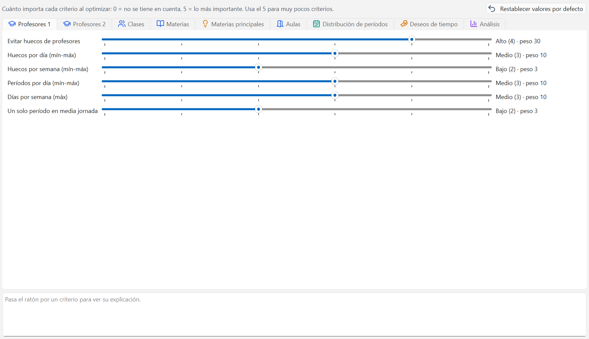

# Ponderación

La Ponderación es donde le dices al programa qué te molesta más. Un horario perfecto no existe:
siempre hay que elegir entre un hueco de profesor y una clase por la tarde, y esta ventana
decide cuál de los dos prefieres evitar.

## Para qué sirve

Al generar, el programa busca el horario con el número de evaluación más bajo posible. Ese
número es la suma de todo lo que no te gusta, y cada cosa cuenta según lo que tú hayas dicho
aquí. Subir un deslizador no prohíbe nada: hace que esa pega salga más cara, y el generador
prefiera pagar otra.

La franja de arriba lo resume: `Cuánto importa cada criterio al optimizar: 0 = no se tiene en
cuenta, 5 = lo más importante. Usa la 5 para muy pocos criterios.`

## La escala 0-5

Cada criterio tiene un deslizador de seis posiciones. A la derecha se ve el nombre de la
posición y el peso con el que cuenta cada violación:

| Posición | Nombre | Peso |
| --- | --- | --- |
| 0 | Desactivado | 0 |
| 1 | Muy bajo | 1 |
| 2 | Bajo | 3 |
| 3 | Medio | 10 |
| 4 | Alto | 30 |
| 5 | Máximo | 300 |

Fíjate en el salto: de `Alto (4)` a `Máximo (5)` el peso se multiplica por diez. Un criterio en
5 aplasta a todos los demás. Por eso la regla es: como mucho un criterio en 5, y unos pocos
en 4.

Para mover un deslizador, arrástralo o haz clic en él y usa las flechas del teclado. El cambio
se guarda solo y se puede deshacer con Ctrl+Z.

Al pasar el ratón por un criterio, el panel de abajo explica exactamente qué cuenta ese
criterio como violación.

Si te has perdido, `Restablecer valores por defecto` vuelve a dejarlo todo como en un proyecto
nuevo y dice cuántos criterios ha cambiado.

## Las pestañas y sus criterios

### Profesores 1

Lo que afecta a la jornada diaria de cada profesor.

| Criterio | Qué cuenta |
| --- | --- |
| Evitar huecos de profesores | Cada período libre de un profesor entre dos clases del mismo día |
| Huecos por día (mín-máx) | Días en que los huecos del profesor salen del rango de su ficha |
| Huecos por semana (mín-máx) | Huecos semanales fuera del rango de la ficha del profesor |
| Períodos por día (mín-máx) | Períodos por encima o por debajo del rango diario del profesor |
| Días por semana (máx) | Días trabajados por encima del máximo del profesor |
| Un solo período en media jornada | Medias jornadas con un solo período del profesor |

### Profesores 2

El resto de la comodidad del profesorado.

| Criterio | Qué cuenta |
| --- | --- |
| Períodos seguidos (máx) | Períodos seguidos por encima del máximo de la ficha del profesor |
| Almuerzo de profesores | Días de mañana y tarde sin períodos libres en la franja del almuerzo |
| Tarde con un solo período | Tardes en las que el profesor tiene una única clase |
| Carga diaria equilibrada | Diferencia entre el día más cargado y el menos cargado del profesor |
| Optimización de profesores | Sesiones con líneas sin profesor asignado |

### Clases

| Criterio | Qué cuenta |
| --- | --- |
| Evitar huecos de clases | Cada período libre de una clase entre dos lecciones del mismo día |
| Períodos por día de la clase (mín-máx) | Períodos fuera del rango diario de su ficha |
| Almuerzo de clases | Días de mañana y tarde sin descanso en la franja del almuerzo |
| Clases por la tarde | Tardes con clase, por clase y día |
| Un solo período en media jornada (clase) | Medias jornadas con un solo período |

### Materias

| Criterio | Qué cuenta |
| --- | --- |
| Períodos dobles | Dobles por debajo o por encima del rango pedido en la lección |
| Bloques | Bloques de 3 o más períodos pedidos que no se consiguen |
| No dos veces el mismo día | Lecciones marcadas en dos tramos separados el mismo día |
| No en días seguidos | Pares de días seguidos en los que aparece una lección marcada |
| Secuencia de materias | Días en que una lección va antes que la materia que debe precederla |
| Aula obligatoria de la materia | Sesiones fuera del aula que exige su materia |

### Materias principales

| Criterio | Qué cuenta |
| --- | --- |
| Materias principales por día (máx) | Períodos por encima del máximo diario de la clase |
| Materias principales no seguidas | Dos materias principales distintas seguidas en una clase |
| Materias principales por la mañana | Sesiones de materias principales que caen por la tarde |
| Grupo de materias no seguido | Dos materias distintas del mismo grupo seguidas en una clase |

### Aulas

| Criterio | Qué cuenta |
| --- | --- |
| Optimización de aulas | Sesiones fuera del aula pedida y de su cadena de alternativas |
| Capacidad del aula | Sesiones con más alumnos que plazas del aula |
| Cadena de aulas alternativas | Qué lugar ocupa en la cadena el aula usada (1 = la primera) |

### Distribución de períodos

| Criterio | Qué cuenta |
| --- | --- |
| Misma materia el mismo día | Tramos separados de la misma materia en una clase el mismo día |
| Reparto uniforme en la semana | Días de menos respecto al mejor reparto posible de la lección |
| Mismo período en días seguidos | Veces que una lección repite período en días seguidos |
| Último período del día | Días en que una clase ocupa el último período de su rejilla |

### Deseos de tiempo

Cuánto pesan los deseos que pusiste en
[Deseos de tiempo y marco horario](04-deseos-y-marco-horario.md).

| Criterio | Qué cuenta |
| --- | --- |
| Deseos de profesores | Suma de los deseos negativos de profesores ocupados |
| Deseos de clases | Suma de los deseos negativos de clases ocupadas |
| Deseos de aulas | Suma de los deseos negativos de aulas ocupadas |
| Deseos de materias | Suma de los deseos negativos de materias colocadas |
| Deseos no especificados | Días, mañanas o tardes libres pedidos que no se consiguen |

Los deseos -3 y +3 no dependen de este deslizador: son duros y el generador no los rompe nunca.

### Análisis

La última pestaña no tiene deslizadores. Es una tabla de solo lectura con el reparto real de
puntos del horario activo, ordenada de mayor a menor: `Criterio`, `Pestaña`, `Deslizador`,
`Peso`, `Violaciones` y `Puntos`. Arriba se lee el resumen
`Número de evaluación {n}: {n} sin colocar, {n} choque(s)`.

Es la pestaña que dice dónde tocar: los criterios de arriba son los que te están costando el
horario. Si no hay horario generado todavía, pone `Sin horario activo: no hay nada que
analizar`.

## Cómo se lee el número de evaluación

El número de evaluación es la nota del horario, y **cuanto más bajo, mejor**. Se calcula así:

- Cada período que no ha podido colocarse suma una penalización enorme.
- Cada choque (dos clases del mismo profesor a la misma hora) suma lo mismo que un período sin
  colocar.
- Todo lo demás son **puntos blandos**: violaciones x peso del criterio.

Por eso el número solo se puede comparar entre horarios del mismo proyecto y con la misma
ponderación. Si cambias un deslizador, el número cambia aunque el horario sea idéntico: no te
asustes, compara siempre con la misma regla.

Un número de seis cifras con cero sin colocar y cero choques es un horario sano. Un número de
seis cifras con cuatro períodos sin colocar es otra cosa: ahí el número lo manda casi todo la
penalización de esos cuatro períodos.

## Receta práctica

1. Deja los valores de serie tal como están. Están pensados para funcionar en un colegio normal
   y ya traen `Evitar huecos de clases` en 5, que es lo que más se nota.
2. Genera un horario con la estrategia B en [Generar el horario](07-generar-el-horario.md).
3. Abre la pestaña `Análisis` y mira los tres o cuatro criterios de arriba.
4. Pregúntate si de verdad te molestan. La mayoría de las veces, no: son el precio normal de un
   horario completo.
5. Sube uno o dos puntos **solo** el criterio que de verdad duela, y baja a cambio otro que te
   dé igual. Si todo sube, no has dicho nada.
6. Vuelve a generar y compara el número y el reparto de puntos. Si el criterio que subiste ha
   bajado pero el horario global ha empeorado mucho, has pedido demasiado.

Ten paciencia: un cambio de ponderación solo se ve después de volver a generar. No cambia el
horario que ya tienes.

## Errores frecuentes

**"Lo he puesto todo en 5 y el horario ha salido peor."**
Si todo es máximo, nada lo es: el generador no sabe qué sacrificar y acaba repartiendo mal.
Pulsa `Restablecer valores por defecto` y sube solo lo que hayas visto arriba en el `Análisis`.

**"He cambiado un deslizador y el número de evaluación ha subido sin hacer nada."**
Es normal: has cambiado la regla con la que se mide, no el horario. Genera de nuevo y compara
desde cero.

**"Quiero prohibir las clases a última hora y no hay forma."**
La Ponderación no prohíbe, solo encarece. Lo que prohíbe es cerrar esa hora con un deseo -3 en
[Deseos de tiempo y marco horario](04-deseos-y-marco-horario.md), o con el clic derecho en el
[Diálogo de planificación](09-planificacion-manual.md).

---

Siguiente: [Generar el horario](07-generar-el-horario.md).
