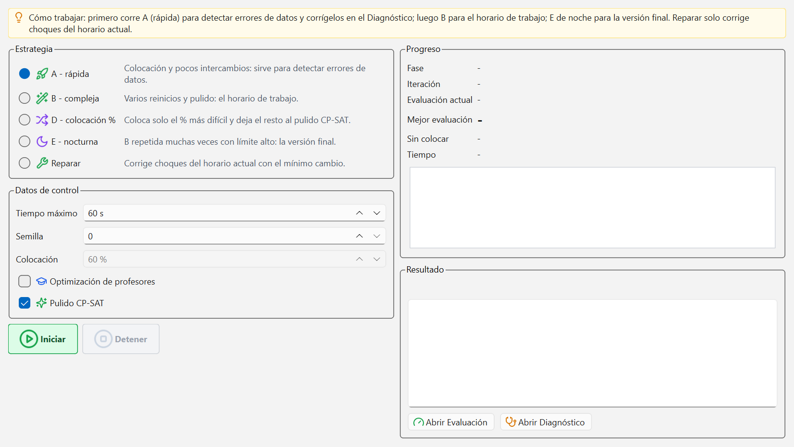

# Generar el horario

La ventana Optimización es la que calcula el horario entero: respeta la rejilla, las lecciones
y los deseos, y lo mejora según la Ponderación. Aquí eliges cómo de a fondo quieres que
trabaje y ves en directo cómo mejora.

## Antes de empezar

La franja amarilla de arriba resume el orden de trabajo:

> Cómo trabajar: primero corre A (rápida) para detectar errores de datos y corrígelos en el
> Diagnóstico; luego B para el horario de trabajo; E de noche para la versión final. Reparar
> solo corrige choques del horario actual.

El botón `Iniciar` está apagado si no se puede generar todavía, y al lado sale el motivo:

- `No hay lecciones que colocar: créalas en la ventana Lecciones (materia, profesor, clases y
  períodos).`
- `Hay {n} error(es) en los datos (p. ej. «...»). Corrígelos desde el Diagnóstico antes de
  optimizar.`

Los errores de datos no son opcionales: mientras existan, el programa no genera. Ve a
[Diagnóstico y evaluación](08-diagnostico-y-evaluacion.md) y arréglalos.

## Las estrategias

| Estrategia | Qué hace | Tiempo de serie |
| --- | --- | --- |
| `A - rápida` | Colocación y pocos intercambios: sirve para detectar errores de datos. | 60 s |
| `B - compleja` | Varios reinicios y pulido: el horario de trabajo. | 600 s (10 min) |
| `D - colocación %` | Coloca el % más difícil; el resto, al pulido. | 600 s (10 min) |
| `E - nocturna` | B repetida muchas veces con límite alto: la versión final. | 1800 s (30 min) |
| `Reparar` | Corrige choques del horario actual con el mínimo cambio. | 30 s |

Cuándo usar cada una:

- **A** es la primera pasada, siempre. No busca un buen horario: busca enseñarte lo que no
  encaja. Si A deja veinte períodos sin colocar, el problema está en los datos, no en el
  cálculo.
- **B** es la que usarás el noventa por ciento del tiempo: el horario con el que trabajas,
  ajustas la ponderación y vuelves a generar.
- **D** reparte de otra manera: coloca primero el porcentaje de lecciones más difícil (el campo
  `Colocación`, 60 % de serie) y deja el resto al pulido exacto. En algunos colegios da mejor
  resultado que B; pruébala cuando B se haya quedado atascada en el mismo número.
- **E** es la nocturna: la dejas corriendo al salir y a la mañana siguiente tienes la mejor
  versión. Sube el `Tiempo máximo` a varias horas si vas a hacerlo de verdad.
- **Reparar** no genera nada nuevo: coge el horario que ya tienes, lo toca lo mínimo posible y
  quita los choques. Es lo que se usa después de haber movido cosas a mano.

## Los datos de control

- `Tiempo máximo`: la optimización se para sola al llegar a este tiempo. Cada estrategia
  recuerda el suyo, así que puedes subir el de E sin tocar el de A.
- `Semilla`: cambia la semilla para obtener otro horario distinto con los mismos datos. Con la
  misma semilla y los mismos datos sale siempre lo mismo.
- `Colocación`: solo para la estrategia D. Qué parte de las lecciones coloca antes del pulido.
  Con las demás estrategias está apagado.
- `Optimización de profesores`: deja que la optimización elija profesor en las líneas que no lo
  tienen. Solo tiene sentido si has dejado líneas sin profesor a propósito.
- `Pulido CP-SAT`: al final, un repaso exacto que suele bajar algo más el número de evaluación.
  Viene marcado y conviene dejarlo así.

## Generar

1. Elige la estrategia.
2. Ajusta el `Tiempo máximo` si quieres dar más o menos margen.
3. Pulsa `Iniciar`.
4. Mira el panel `Progreso`: `Fase`, `Iteración`, `Evaluación actual`, `Mejor evaluación`,
   `Sin colocar` y `Tiempo`, con un gráfico de cómo baja la mejor evaluación.
5. Al acabar, el panel `Resultado` dice el número final y el registro de fases. Desde ahí,
   `Abrir Evaluación` y `Abrir Diagnóstico` llevan a las dos ventanas donde se juzga el
   resultado.

Mientras se optimiza, las demás ventanas quedan bloqueadas para no mezclar cambios. Solo esta
sigue activa, porque aquí está el botón `Detener`.

Cada generación crea un horario nuevo con el nombre `Estrategia B (...)` y lo deja activo. Los
anteriores no se pierden: están en la lista `Horarios generados` de
[Diagnóstico y evaluación](08-diagnostico-y-evaluacion.md).

## Detener a mitad

Pulsa `Detener` cuando quieras: `Para la optimización y se queda con el mejor horario
encontrado hasta ahora`. No pierdes el trabajo hecho, y el resultado se guarda igual que si
hubiera terminado; la `Fase` pasa a `Detenido`.

Conviene detener cuando el gráfico lleva un rato plano: si la mejor evaluación no baja en
varios minutos, lo que quede de tiempo no va a cambiar mucho.

## "Sin colocar" y "choques"

Son las dos cifras que hay que mirar antes que el número de evaluación.

- **Sin colocar** son períodos que no tienen hora. La lección pide, por ejemplo, tres horas a la
  semana y solo se han podido poner dos. El horario está incompleto.
- **Choques** son recursos ocupados dos veces a la misma hora: el mismo profesor en dos aulas,
  la misma clase con dos materias, la misma aula con dos grupos.

Las dos deben ser cero. Un horario con choques no se puede publicar, y uno con períodos sin
colocar deja clases descubiertas. Cada una de las dos penaliza tantísimo en el número de
evaluación que, mientras no sean cero, comparar números entre horarios no dice nada útil.

## Si quedan horas sin colocar

Casi nunca es culpa del cálculo. Por orden:

1. Abre el Diagnóstico y mira la rama `Datos de entrada`. El grupo `Períodos sin colocar` te
   dice qué lecciones son.
2. Mira si a esa clase o a ese profesor le sobran horas: el resumen de carga de
   [Lecciones](05-lecciones.md) avisa en rojo cuando hay más períodos que huecos.
3. Mira los deseos -3. Un profesor con tres tardes cerradas y veinte horas semanales no cabe en
   ningún horario. Abre
   [Deseos de tiempo y marco horario](04-deseos-y-marco-horario.md) y afloja lo que puedas.
4. Mira los acoples y las aulas obligatorias: si cinco lecciones distintas exigen el único
   gimnasio a la vez, alguna se quedará fuera.
5. Solo cuando todo lo anterior esté limpio, dale más tiempo o prueba otra semilla.

También puedes colocar a mano lo que queda desde el
[Diálogo de planificación](09-planificacion-manual.md): las sesiones sin colocar salen en una
lista a la izquierda y se arrastran a un hueco libre.

## Genera varias veces

El generador no es determinista más allá de la semilla: dos intentos con semillas distintas dan
horarios distintos y, a veces, con diferencias grandes.

La costumbre que mejor funciona:

1. Lanza B tres o cuatro veces seguidas cambiando la `Semilla` (0, 1, 2, 3...).
2. Deja que cada una termine; todas se guardan.
3. Abre la Evaluación, mira la lista `Horarios generados` y quédate con el que tenga menos
   `Sin colocar`, menos `Choques` y, en último lugar, menos `Evaluación`.
4. Pulsa `Activar` en ese y borra los demás si molestan.

Vale la pena: la diferencia entre la primera generación y la mejor de cuatro suele ser mayor
que la que consigues afinando la ponderación durante una hora.

## Errores frecuentes

**El botón `Iniciar` está gris y no se puede pulsar.**
Lee el aviso amarillo que sale debajo: o no hay lecciones activas, o el diagnóstico de datos
tiene errores. Los errores hay que corregirlos; no hay manera de saltárselos.

**"He generado otra vez y he perdido el horario que me gustaba."**
No se ha perdido. Cada generación añade un horario a la lista `Horarios generados` de la
Evaluación; el último se pone activo, pero el anterior sigue ahí. Selecciónalo y pulsa
`Activar`.

**"He movido clases a mano y ahora hay choques."**
Elige la estrategia `Reparar` y pulsa `Iniciar`: corrige los choques del horario actual con el
mínimo cambio posible, en lugar de rehacerlo todo.

---

Siguiente: [Diagnóstico y evaluación](08-diagnostico-y-evaluacion.md).
