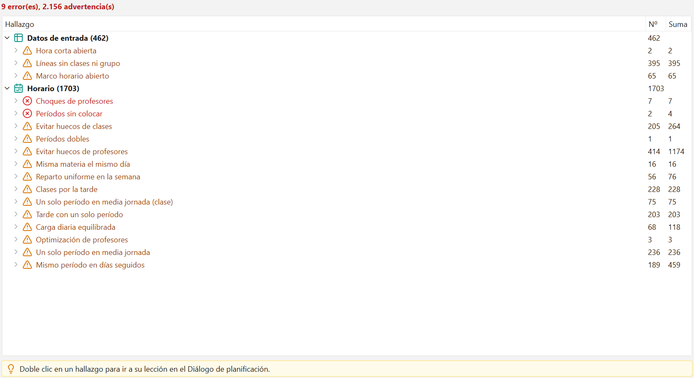
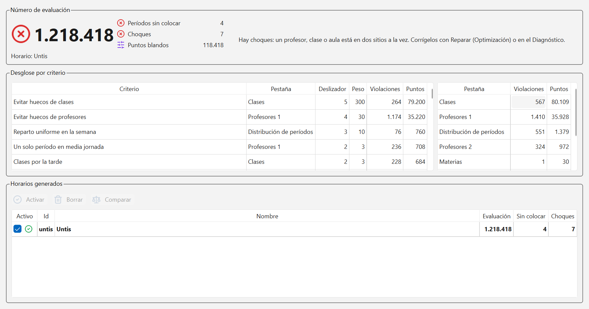

# Diagnóstico y evaluación

Dos ventanas que trabajan en pareja: el Diagnóstico es la lista de problemas, con salto directo
a cada uno, y la Evaluación es la nota del horario, con el desglose de dónde vienen los puntos.

## El Diagnóstico

El Diagnóstico vive en un panel a la derecha, siempre a mano. Es un árbol de tres niveles:

1. La rama: `Datos de entrada` u `Horario`.
2. El grupo: qué tipo de problema es, con cuántos casos hay.
3. El caso concreto, con su frase completa.

Las columnas son `Hallazgo`, `Nº` (cuántos casos hay en el grupo) y `Suma` (la cantidad total
del grupo: períodos, huecos, lo que mida ese criterio). Arriba, en negrita, el resumen:
`{n} error(es), {n} advertencia(s)`.

Los grupos van ordenados por gravedad, los errores primero. Al pasar el ratón por un grupo, la
ayuda emergente explica qué cuenta y qué hacer.

### Errores frente a avisos

- **Errores** (en rojo): impiden generar el horario. Mientras haya uno solo, el botón `Iniciar`
  de Optimización está apagado. No son sugerencias: son cosas que no pueden ser.
- **Advertencias** (en ámbar): mejoras posibles, no fallos. El horario se genera igual, pero
  casi siempre merece la pena mirarlas antes.

## El diagnóstico de datos

La rama `Datos de entrada` se calcula sin necesidad de horario. Es lo primero que hay que dejar
limpio.

Errores típicos y qué hacer (las ventanas de Profesores, Clases y Aulas están en
[Datos maestros](02-datos-maestros.md)):

- `Marco horario insuficiente`: la clase pide más horas de las que tiene abiertas. Se arregla
  en el marco horario o quitando horas en Lecciones.
- `Clases con más períodos que huecos`: la clase suma más horas de las que ofrece su rejilla.
  Se arregla en la rejilla o en Lecciones.
- `Lecciones sin períodos por semana`: una lección con 0 horas. Se arregla en Lecciones.
- `Líneas con un profesor que no existe`: la línea nombra a alguien que no está dado de alta.
  Se arregla en Profesores o en Lecciones.
- `Líneas sin clases ni grupo`: una línea que no se la da nadie a nadie. Se arregla en
  Lecciones.
- `Lecciones con el número repetido`: dos lecciones con el mismo número. Se arregla en
  Lecciones.
- `Dobles que no pueden cumplirse`: se piden más dobles de los que caben en las horas
  semanales. Se arregla en Lecciones.
- `Aulas alternativas en círculo`: la cadena de aulas alternativas se muerde la cola. Se
  arregla en Aulas.
- `Deseos de tiempo contradictorios`: la misma celda está marcada -3 y +3 a la vez. Se arregla
  en Deseos de tiempo.
- `Rejillas sin períodos`: una rejilla de tiempo vacía. Se arregla en el marco horario.

Advertencias típicas: `Marco horario abierto` y `Hora corta abierta`.

### Dos ejemplos reales

**La clase 'KK1 - Clase 001' necesita 26 períodos/semana y solo tiene 25 horas abiertas: amplía
su marco horario o quita deseos -3.**

Es un error, y de los más comunes al empezar de cero. Has dado 26 horas de clase a un curso
cuya jornada, después de los deseos -3, solo tiene 25 huecos. No hay horario posible: falta una
hora física. O abres una hora más en el marco horario, o quitas un -3, o le quitas una hora a
alguna lección.

**La hora 1 de la rejilla 'Kinder' dura 10 min frente a los 45 habituales y está abierta para
25 clase(s): ciérrala si solo es para dirección de grupo.**

Es una advertencia. Has creado una hora corta (la entrada, la tutoría, el pase de lista) y la
has dejado abierta para todo el mundo. El generador la tratará como una hora lectiva más y
puede meter ahí una clase de matemáticas de diez minutos. Si esa franja es solo para dirección
de grupo, ciérrala con un deseo -3 para las clases que no la usan.

**La clase 'KK1' tiene 32 horas abiertas y solo necesita 26: si su jornada termina antes,
ciérrala en Deseos de tiempo (marco horario).**

También es una advertencia, y la contraria de la primera. Sobra espacio, así que el generador
puede repartir las clases hasta las cinco de la tarde aunque el colegio cierre a las dos.
Cierra las horas que no se usan.

## El diagnóstico del horario

La rama `Horario` solo tiene sentido con un horario ya generado y activo. Reúne lo que le pasa
a ese horario concreto:

- `Períodos sin colocar`: períodos que aún no tienen hora. Arrástralos desde la lista del
  [Diálogo de planificación](09-planificacion-manual.md).
- `Choques de profesores`, `Choques de clases`, `Choques de aulas`: un recurso está ocupado dos
  veces a la misma hora. Corrígelo moviendo una de las lecciones o con `Reparar` en
  [Optimización](07-generar-el-horario.md).
- `Deseos imposibles (-3) incumplidos`: se ha colocado clase en una hora cerrada.
- Los criterios de la [Ponderación](06-ponderacion.md) que se están incumpliendo: huecos de
  clases, huecos de profesores, materias principales por la tarde...

Los grupos de esta rama llegan ordenados por peso: los de arriba son los que más te están
costando.

## Saltar a la lección conflictiva

1. Despliega el grupo que te interese.
2. Haz doble clic en un caso concreto.

El programa abre el [Diálogo de planificación](09-planificacion-manual.md), pone en foco la
clase, el profesor o el aula afectada y selecciona las celdas de esa lección. El aviso de abajo
lo recuerda: `Doble clic en un hallazgo para ir a su lección en el Diálogo de planificación.`

Desde ahí ya puedes mover, fijar o desprogramar la sesión sin buscarla a mano.

## La Evaluación

La ventana Evaluación pone número a lo bueno que es el horario activo.

Arriba, en grande, el **número de evaluación**, con un icono de estado y una frase que lo
interpreta:

- Verde: `Horario completo y sin choques. Cuanto más bajo el número, mejor.`
- Ámbar: `No hay choques, pero quedan períodos sin colocar: colócalos en el Diálogo de
  planificación u optimiza de nuevo.`
- Rojo: `Hay choques: un profesor, clase o aula está en dos sitios a la vez. Corrígelos con
  Reparar (Optimización) o en el Diagnóstico.`

Al lado, las tres cifras que lo componen:

- `Períodos sin colocar`: deben ser 0.
- `Choques`: deben ser 0.
- `Puntos blandos`: todo lo demás. Es la cifra que de verdad compara dos horarios sanos.

En el ejemplo de la imagen, 1.218.418 puntos con 4 períodos sin colocar y 7 choques: de esos,
solo 118.418 son puntos blandos. El resto es la penalización de lo que falta. Por eso no tiene
sentido afinar la ponderación mientras esas dos cifras no estén a cero.

Debajo se lee de qué horario se habla: `Horario: Untis`.

## El desglose por criterio

La caja `Desglose por criterio` tiene dos tablas.

La de la izquierda, una fila por criterio, ordenada de más a menos puntos:

| Columna | Qué es |
| --- | --- |
| `Criterio` | El nombre del criterio, tal como sale en la Ponderación |
| `Pestaña` | En qué pestaña de Ponderación está su deslizador |
| `Deslizador` | En qué posición 0-5 lo tienes |
| `Peso` | El peso que corresponde a esa posición |
| `Violaciones` | Cuántas veces se incumple |
| `Puntos` | Violaciones x peso: lo que aporta al número |

La de la derecha es el subtotal por pestaña: `Pestaña`, `Violaciones` y `Puntos`. Sirve para ver
de un vistazo si el horario se te está yendo por los profesores, por las clases o por el
reparto de la semana.

La lectura correcta es de arriba abajo, y siempre mirando las dos últimas columnas juntas. Un
criterio con 1.174 violaciones y peso 30 cuesta 35.220 puntos; otro con 264 violaciones y peso
300 cuesta 79.200. El segundo es el que manda, aunque tenga muchas menos violaciones.

## Comparar y activar horarios

La caja `Horarios generados` lista todas las versiones que has calculado, con `Activo`, `Id`,
`Nombre`, `Evaluación`, `Sin colocar` y `Choques`.

- `Activar`: hace activo el horario elegido. Es el que ven la Planificación y los Horarios.
- `Borrar`: borra los horarios elegidos (se puede deshacer).
- `Comparar`: elige dos horarios con Ctrl+clic y compara sus cifras criterio a criterio. La
  tabla de abajo muestra los dos valores y la `Diferencia`, en verde si el segundo mejora y en
  rojo si empeora.

Si no has generado nada todavía, sale el aviso: `Aún no hay horarios generados: pulsa Iniciar en
la ventana Optimización.`

## Errores frecuentes

**"El Diagnóstico dice que todo está bien pero el horario tiene huecos horrorosos."**
El Diagnóstico solo marca como error lo que es imposible. Los huecos son un criterio de la
Ponderación, no un error: mira el `Desglose por criterio` de la Evaluación y sube `Evitar huecos
de clases` o `Evitar huecos de profesores`.

**"He corregido los datos y el Diagnóstico sigue enseñando el error viejo."**
El panel se recalcula cuando está visible, con un instante de espera para no frenar la edición.
Pasa a otra ventana y vuelve, o espera un segundo; el resumen de arriba se actualiza solo.

**"Comparo dos horarios y uno tiene mejor número pero peor pinta."**
Comprueba primero `Sin colocar` y `Choques`: un horario con un período sin colocar puede tener
un número enorme aunque el resto sea mejor. Y al revés: si uno tiene 0 y 0, el número sí es
comparable.

---

Siguiente: [Planificación manual](09-planificacion-manual.md).
