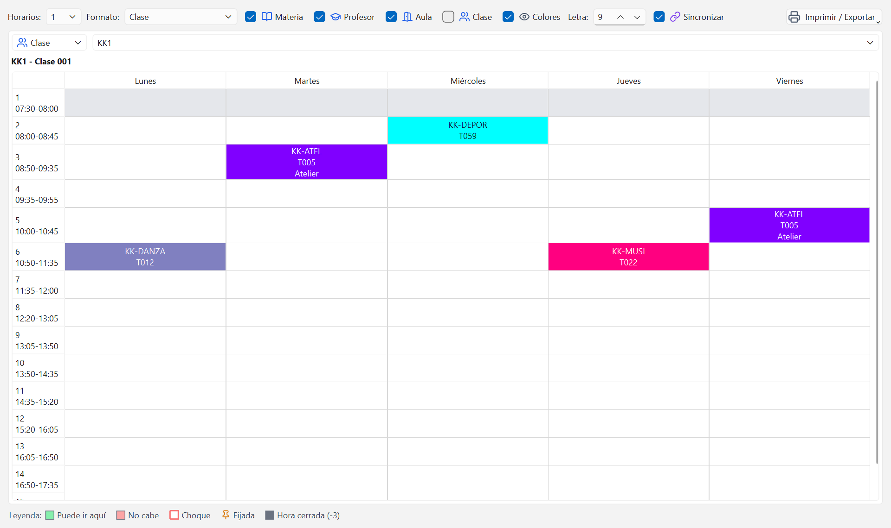

# Horarios, impresión y PDF

La ventana Horarios es la que se enseña a la gente: el horario de cada clase, de cada profesor
o de cada aula, con el aspecto que quieras, listo para imprimir o para repartir en PDF. Y las
clases se mueven aquí mismo, arrastrándolas con el ratón.

## Ver un horario

1. Abre la ventana Horarios.
2. En el desplegable de la izquierda del panel, elige el tipo: `Clase`, `Profesor`, `Aula` o
   `Materia`.
3. En el desplegable de al lado, elige cuál. Encima de la cuadrícula sale el nombre completo,
   por ejemplo `KK1 - Clase 001`.

Los días van en columnas y los períodos en filas, con su número y su hora de reloj
(`3` / `08:50-09:35`). Los recreos salen en gris. Cada celda lleva el color de su materia, y al
pasar el ratón por encima se ve la lección completa.

La leyenda de abajo explica las marcas: `Choque`, `Fijada` y `Hora cerrada (-3)`.

Aquí no se edita nada: para mover clases está el
[Diálogo de planificación](09-planificacion-manual.md).

## Varios horarios a la vez

El campo `Horarios:` pone 1, 2 o 4 paneles en la ventana. Con cuatro puedes comparar, por
ejemplo, los cuatro grupos de un curso, o una clase y los tres profesores que se la reparten.

Cada panel tiene su propio tipo y su propia entidad.

La casilla `Sincronizar` hace que los paneles sigan lo que eliges en las demás ventanas: si
seleccionas un profesor en Datos maestros, el panel de profesores se pone en ese profesor.
Desmárcala cuando quieras fijar una comparación y que no se te mueva.

## Mover una clase arrastrando

Igual que en Untis, no hace falta salir de aquí para cambiar una hora de sitio: arrastra la
clase de una celda a otra dentro del mismo panel.

1. Pulsa sobre la clase que quieres mover y arrastra sin soltar.
2. El horario se pinta entero: en **verde** las horas donde esa clase cabe y en **rojo** las
   que no. Deja el ratón quieto sobre una celda roja y la ayuda emergente dice por qué no
   cabe: "el profesor está ocupado", "deseo imposible (-3)" o "lección fijada".
3. Al pasar por encima de una hora verde aparece abajo cuánto **mejora o empeora la
   evaluación** si la sueltas ahí: un número negativo es una mejora.
4. Suelta en la hora que quieras. La clase se mueve y todos los paneles se actualizan.
5. Si te arrepientes a mitad, pulsa **Esc**; y si ya la soltaste, **Ctrl+Z** lo deshace.

Nunca se generan choques: una hora en la que el profesor, el grupo o el aula estén ocupados
sale en rojo y no acepta la clase. Las horas cerradas con un deseo -3 tampoco.

Solo se arrastra en el panel donde empiezas, y solo si estás viendo el horario activo. Si
tienes abierto un horario generado antiguo, cámbialo antes en la lista de horarios.

Para desprogramar una clase, fijarla o intercambiar dos, usa el
[Diálogo de planificación](09-planificacion-manual.md): allí está el menú contextual con
todas esas opciones y la lista de clases sin colocar.

## Los formatos

El desplegable `Formato:` aplica de golpe una combinación ya pensada:

| Formato | Qué muestra cada celda |
| --- | --- |
| `Clase` | Materia, profesor y aula |
| `Profesor` | Materia, aula y clase |
| `Aula` | Materia, profesor y clase |
| `Completo` | Materia, profesor, aula y clase |
| `Compacto` | Solo la materia, con letra más pequeña |
| `Impresión (sin colores)` | Materia, profesor y aula, sin color y con letra mayor |

Después puedes retocar a mano con las casillas de al lado: `Materia`, `Profesor`, `Aula`,
`Clase` y `Colores`, y con `Letra:` el tamaño del texto de las celdas.

`Impresión (sin colores)` es el formato pensado para el papel y para las fotocopias en blanco y
negro: sin fondos de color y con la letra un punto más grande.

## Imprimir

1. Deja activo el panel con el horario que quieres (haz clic en él).
2. Abre el menú `Imprimir / Exportar`.
3. Elige `Imprimir...`.
4. Se abre el diálogo de impresión de Windows: elige impresora, tamaño y copias, y acepta.

Se imprime el horario del panel activo, con el formato que tengas puesto en ese momento.

Las cabeceras y el pie de las impresiones (nombre del colegio, curso, fecha) se editan en Datos
del colegio, no aquí.

## Exportar a PDF y a HTML

Todas las opciones están en el mismo menú `Imprimir / Exportar`:

| Opción | Qué hace |
| --- | --- |
| `PDF del horario...` | Guarda el horario del panel activo como PDF |
| `HTML del horario...` | Guarda el horario del panel activo como página web |
| `Exportar todos (HTML, uno por entidad)...` | Una página web por cada clase, profesor o aula |
| `Exportar todos (un PDF)...` | Todos los horarios del tipo del panel activo en un único PDF |
| `Exportar GPU (MiUntisWeb)...` | Archivos GPU del horario activo, para subirlos a MiUntisWeb |
| `Exportar XML (Untis)...` | Todo el proyecto en XML para abrirlo en Untis |

Las dos opciones de "todos" usan el **tipo del panel activo**: si el panel está en `Profesor`,
exporta los horarios de todos los profesores. Piden una carpeta de destino y, al acabar, la
barra de estado dice cuántos archivos ha escrito.

Para repartir por correo, `Exportar todos (un PDF)` con el formato `Impresión (sin colores)` es
la combinación más cómoda: un solo archivo, una página por entidad.

Para colgar en la web del centro, `Exportar todos (HTML, uno por entidad)` deja una carpeta con
una página por clase, con colores y listas para subir.

## Qué horario se está viendo

Esta ventana muestra siempre el **horario activo**, no el último generado.

Cuando has generado varias versiones (y conviene hacerlo: ver
[Generar el horario](07-generar-el-horario.md)), todas se guardan. La activa es la que se ve
aquí, en el Diálogo de planificación y en el Diagnóstico.

Para cambiar de versión:

1. Abre la ventana Evaluación.
2. En la lista `Horarios generados`, selecciona la fila que quieras.
3. Pulsa `Activar`.
4. Vuelve a Horarios: la cuadrícula ya muestra la otra versión.

En la Evaluación, la fila activa lleva marca en la columna `Activo` y se ve en negrita, con su
`Evaluación`, `Sin colocar` y `Choques` al lado. Es el sitio donde comprobar, antes de
imprimir, que estás repartiendo la versión buena. Todo esto se explica en
[Diagnóstico y evaluación](08-diagnostico-y-evaluacion.md).

## Errores frecuentes

**"He impreso los horarios y son de la versión antigua."**
Habías generado una versión nueva, pero no la activaste. Ve a Evaluación, selecciona la fila
correcta y pulsa `Activar` antes de exportar.

**"El PDF sale ilegible o se corta."**
Baja el tamaño en `Letra:` o cambia a `Compacto`, y usa `Impresión (sin colores)` si el problema
son los fondos oscuros. Con muchas horas por día, un cuerpo de 8 o 9 entra mejor en una página.

**"Exportar todos me ha sacado las clases y yo quería los profesores."**
La exportación masiva usa el tipo del panel activo. Pon ese panel en `Profesor`, haz clic dentro
de él para que quede activo y vuelve a exportar.

---

Anterior: [Planificación manual](09-planificacion-manual.md).
