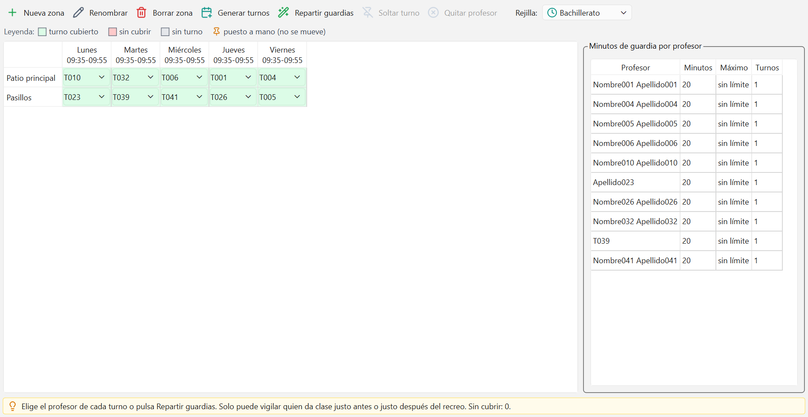

# Guardias de recreo

Aquí decides quién vigila cada zona del colegio en cada recreo. El programa crea los turnos de
toda la semana, los reparte solo entre quienes ya están en el centro a esa hora y te enseña
cuántos minutos de guardia lleva cada profesor.

La ventana tiene tres partes: la barra de botones con el selector **Rejilla:**, la parrilla
(una fila por zona, una columna por recreo de cada día) y, a la derecha, el cuadro **Minutos de
guardia por profesor**. Abajo, una línea de consejo te dice siempre cuántos turnos quedan sin
cubrir.

La barra de arriba trae siete botones con su nombre al lado del icono: **Nueva zona**,
**Renombrar**, **Borrar zona**, **Generar turnos**, **Repartir guardias**, **Soltar turno** y
**Quitar profesor**.

## Qué es una zona de vigilancia

Una zona es un sitio que hay que vigilar durante el recreo: el patio, los pasillos, el comedor,
la entrada. No es un aula ni un grupo: es un puesto de vigilancia.

Cada zona pertenece a una rejilla de tiempo, la que esté elegida en **Rejilla:** cuando la
creas. Si tu colegio tiene jornadas distintas por etapa, crea las zonas de cada etapa con su
rejilla seleccionada. Ver [Rejillas de tiempo](03-rejillas-de-tiempo.md).

Un turno es el cruce de una zona con un recreo concreto de un día: "Patio principal, martes, el
recreo de 09:35 a 09:55".

## Crear las zonas

1. En **Rejilla:**, elige la rejilla cuyos recreos vas a repartir.
2. Pulsa **Nueva zona**. Se abre el cuadro "Nueva zona de vigilancia".
3. Escribe el **Nombre corto de la zona:** y acepta. Ese nombre corto es el que se ve en la
   cabecera de la fila.
4. Para darle un nombre más largo, selecciona la fila y pulsa **Renombrar**: el cuadro
   "Renombrar zona" pide el **Nombre de la zona:**.

Para quitar una zona, selecciónala y pulsa **Borrar zona**. Se va con todos sus turnos.

## Generar los turnos de todos los recreos

1. Comprueba que la rejilla tiene sus recreos marcados. Si en la parrilla las casillas salen
   grises y al pasar el ratón dice "Sin turno: pulsa Generar turnos", es que faltan turnos.
2. Pulsa **Generar turnos**. Se crea un turno vacío por cada zona, cada día lectivo y cada
   recreo de esa rejilla.
3. El mensaje te dice cuántos se han creado, por ejemplo "24 turno(s) de guardia creados". Si
   ya estaban todos, dice "La parrilla ya estaba completa".

Puedes volver a pulsarlo cuando quieras. No toca los turnos que ya existen, así que después de
añadir una zona o un recreo nuevo lo pulsas otra vez y no pierdes nada de lo repartido.

## Poner un profesor a mano

1. Haz clic en la casilla del turno.
2. Despliega la lista y elige el profesor. El guion `-` significa "sin cubrir".

La casilla se pone verde en cuanto tiene profesor, y roja mientras está sin cubrir.

Lo que pones a mano queda **fijado**: aparece una chincheta y el reparto automático no lo
toca nunca. Es la forma de respetar los acuerdos que ya tenéis tomados.

- Para que el reparto pueda volver a mover ese turno, selecciona la casilla y pulsa **Soltar
  turno**: se quita la chincheta pero el profesor se queda.
- Para dejar el turno vacío, pulsa **Quitar profesor** (o elige `-` en la lista).

## Repartir automáticamente

1. Genera antes el horario del colegio: el reparto necesita saber quién está en el centro a cada
   hora. Ver [Generar el horario](07-generar-el-horario.md).
2. Pulsa **Repartir guardias**.
3. Lee el mensaje: "18 de 20 turno(s) con profesor" y, si queda alguno suelto, "; 2 sin cubrir
   (nadie disponible)".

El reparto solo toca los turnos que no tienen chincheta. Los fijados se quedan como están, y
los que tenían profesor sin fijar vuelven al reparto, así que puedes repartir tantas veces como
quieras. Con los mismos datos, el resultado es siempre el mismo.

## Las reglas que respeta el reparto

1. **Solo vigila quien ya está en el centro.** Un profesor puede cubrir un recreo si ese día da
   clase en la hora inmediatamente anterior o en la inmediatamente posterior a ese recreo. Nadie
   viene al colegio solo para hacer una guardia. Se prefiere además a quien da clase a los dos
   lados del recreo, porque ya está allí de todas formas.
2. **Nadie en dos sitios a la vez.** En un mismo recreo de un mismo día, un profesor no puede
   tener dos zonas, aunque estén al lado.
3. **El tope de minutos de cada profesor.** En [Datos maestros](02-datos-maestros.md) ->
   Profesores hay una columna **Guardias: minutos/semana máx**. El reparto automático nunca se
   la salta. Si la dejas vacía, ese profesor no tiene tope. Si pones un **0**, queda fuera del
   reparto y ni siquiera aparece en las listas de las casillas.
4. **Reparto equilibrado.** Entre los que pueden, el turno va al que menos minutos lleva
   acumulados, y después el programa hace varias pasadas de ajuste (cambios y permutas de
   turnos) para dejar los minutos lo más parejos posible.

La única regla que se puede incumplir es el tope de minutos, y solo si lo haces tú a mano: el
programa te avisa con un mensaje del estilo "Aviso: T012 llega a 60 min de guardia y su máximo
es 40 min", pero acepta el cambio. Untis se comporta igual.

## El resumen por profesor

El cuadro de la derecha, **Minutos de guardia por profesor**, tiene cuatro columnas:

| Columna | Qué dice |
| --- | --- |
| Profesor | Nombre del profesor |
| Minutos | Minutos de guardia que lleva a la semana |
| Máximo | Su tope semanal, o "sin límite" si no le has puesto ninguno |
| Turnos | Cuántos turnos tiene asignados |

La lista va del más cargado al menos cargado. Quien se pasa de su máximo sale en rojo, y al
pasar el ratón dice "Se pasa de su máximo de guardias".

Solo aparecen los profesores que tienen algún turno o algún máximo declarado. Si tu lista sale
casi vacía, es que aún no has repartido nada.

## Cuando un turno queda sin cubrir

Una casilla roja es un turno sin nadie. Después de repartir, el mensaje te dice cuántos son. El
motivo es casi siempre el mismo: en ese recreo no hay nadie que dé clase justo antes o justo
después, o los que hay ya han llegado a su tope de minutos.

Qué puedes hacer, de menos a más drástico:

1. **Sube el tope de alguien.** Si varios profesores están topados, unos minutos más a la
   semana suelen bastar.
2. **Quita chinchetas.** Si tienes muchos turnos puestos a mano, el reparto trabaja con poco
   margen. Suelta los que no sean imprescindibles y vuelve a repartir.
3. **Pon a alguien a mano.** Elige el profesor en la lista de la casilla. A mano puedes elegir a
   cualquiera, aunque no dé clase al lado del recreo o se pase de minutos; el programa solo
   avisa.
4. **Revisa el horario.** Si en ese recreo el colegio está casi vacío, el problema es de
   horario, no de guardias: mira si puedes mover alguna clase a la hora anterior o posterior
   desde la [planificación manual](09-planificacion-manual.md).
5. **Junta zonas.** Dos zonas pequeñas vigiladas por una persona son mejor que dos turnos
   vacíos.

## Errores frecuentes

**"La rejilla 'Bachillerato' no tiene recreos: márcalos en Rejillas de tiempo"**
Has pulsado **Generar turnos** en una rejilla en la que ningún período está marcado como
recreo. Abre [Rejillas de tiempo](03-rejillas-de-tiempo.md), marca como recreo los períodos que
lo sean y vuelve.

**"Crea antes alguna zona que vigilar"**
La rejilla elegida no tiene ninguna zona. Pulsa **Nueva zona** primero. El aviso de la ventana
lo dice también: "Aún no hay zonas que vigilar en esta rejilla".

**"Hace falta un horario generado para saber quién está en el colegio"**
Has pulsado **Repartir guardias** sin ningún horario. El reparto necesita el horario para saber
quién da clase junto a cada recreo. Genera uno y vuelve a intentarlo.

**"T012 ya vigila otra zona en ese recreo; nadie puede estar en dos sitios"**
Estás poniendo a mano a alguien que ya tiene otro turno en ese mismo recreo. Quítale el otro
turno o elige a otra persona.

---

Siguiente: [Sustituciones](12-sustituciones.md) - el parte del día cuando falta alguien.
