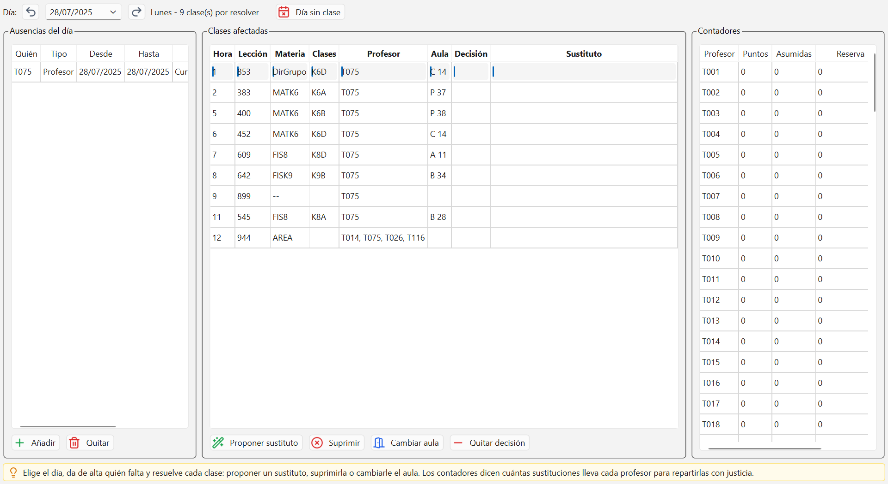

# Sustituciones

El parte del día cuando falta alguien. Registras quién falta, ves qué clases se quedan sin
profesor y resuelves cada una: pones un sustituto, suprimes la clase o le cambias el aula. Los
contadores te ayudan a repartir el trabajo con justicia.

El horario del colegio es de la semana, pero una ausencia es de fechas. Esta ventana trabaja
siempre sobre **un día concreto**: eliges la fecha arriba y todo lo demás se recalcula.

La ventana tiene tres columnas:

- **Ausencias del día**: quién falta ese día, con los botones **Añadir** y **Quitar**.
- **Clases afectadas**: las clases tocadas por esas ausencias y las decisiones ya tomadas, con
  los botones **Proponer sustituto**, **Suprimir**, **Cambiar aula** y **Quitar decisión**.
- **Contadores**: cuántas sustituciones lleva cada profesor.

## El día a día

1. Abre la ventana y elige la fecha en **Día:**. Los botones de flecha a los lados van al día
   anterior y al día siguiente.
2. Al lado de la fecha aparece el día de la semana. Si hay clases por resolver, lo dice: por
   ejemplo "Martes - 6 clase(s) por resolver".
3. Da de alta la ausencia con **Añadir**.
4. Mira la lista **Clases afectadas** y resuelve una a una.
5. Repite cada mañana. Las ausencias de varios días siguen vigentes solas: no hay que volver a
   darlas de alta.

## Los días sin clase

Cuando la fecha cae en un festivo o en vacaciones, el programa no propone nada: al lado de la
fecha pone "Viernes - sin clase: Navidad" y la lista de clases queda vacía con el mensaje "Día
sin clase: Navidad".

Para marcar un día, ponte en esa fecha y pulsa **Día sin clase** en la barra de arriba. El
botón cambia entonces a **Devolver la clase**, que le quita la marca. Es el calendario del
curso en su forma más simple: un día marcado no tiene clases, así que no hay nada que
sustituir en él. Se deshace como cualquier otro cambio, con Ctrl+Z.

## Registrar una ausencia

1. Pulsa **Añadir**. Se abre el cuadro "Nueva ausencia".
2. **Falta un:** elige **Profesor**, **Clase** o **Aula**. No solo faltan personas: una clase
   entera de excursión o un aula en obras también cambian el día.
3. **Quién:** elige de la lista el profesor, la clase o el aula concreta.
4. **Desde el día:** y **Hasta el día:** el primer y el último día de la ausencia, este último
   incluido. Para una ausencia de un solo día, deja las dos fechas iguales.
5. **Desde la hora:** y **Hasta la hora:** solo si la ausencia no ocupa la jornada entera. El
   guion `-` significa desde el principio o hasta el final de la jornada.
6. **Motivo:** texto libre: enfermedad, curso, excursión. Sale luego en la lista y en la
   explicación de cada clase afectada.
7. Acepta. La ausencia aparece en la lista con su id.

En una ausencia de varios días, las horas acotan solo el primer día y el último. "Del lunes a
5ª hasta el miércoles a 2ª" se escribe con **Desde la hora:** 5 y **Hasta la hora:** 2: el
martes falta entero.

La lista **Ausencias del día** tiene las columnas **Quién**, **Tipo**, **Desde**, **Hasta** y
**Motivo**. Pasa el ratón por el motivo y verás las horas que abarca ("3-6", "desde 3", "todo
el día").

Para dar de baja una ausencia, selecciónala y pulsa **Quitar**. Ojo: se borran también las
decisiones que venían de ella.

## El parte del día

La tabla **Clases afectadas** lista cada clase tocada por una ausencia, más las que ya tienen
una decisión tomada:

| Columna | Qué dice |
| --- | --- |
| Hora | Hora de la jornada |
| Lección | Número de la lección del horario |
| Materia | La materia que tocaba |
| Clases | Los grupos que la reciben |
| Profesor | Quien la da normalmente |
| Aula | El aula, o la nueva si se la has cambiado |
| Decisión | Qué has decidido: Sustitución, Clase suprimida, Cambio de aula... |
| Sustituto | Quién la cubre |

Pasa el ratón por las columnas **Decisión** o **Sustituto** y verás el motivo completo, por
ejemplo "Falta T012 (enfermedad)".

Si la lista sale vacía pone "Ningún cambio este día": ese día nadie falta o nadie afectado
tenía clase.

## Pedir la propuesta de sustituto

1. Selecciona la fila de la clase que quieres cubrir.
2. Pulsa **Proponer sustituto**. Se abre el cuadro "Proponer sustituto".
3. La tabla lista a los profesores posibles **del mejor al peor**, con las columnas
   **Profesor**, **Nombre**, **Puntos** y **Por qué**.
4. Elige uno y acepta (o haz doble clic en su fila). Queda asignado.

En el cuadro hay una nota que resume el criterio: "El primero de la lista es el mejor: se
prefiere a quien ya está en el centro, luego a quien da la materia o al grupo, y después a
quien menos sustituciones lleva. Nunca se propone a quien tiene clase o está ausente."

### Quién no sale nunca en la lista

Antes de ordenar nada, el programa descarta por completo a:

- quien a esa hora **tiene clase**;
- quien a esa hora está **de guardia** de recreo;
- quien a esa hora **ya cubre** otra sustitución;
- quien **está ausente** a esa hora;
- los profesores de la propia clase que hay que cubrir;
- quien tiene la **reserva de sustitución en 9**.

La reserva es una columna de [Datos maestros](02-datos-maestros.md) -> Profesores, **Reserva
para sustituir (0-9)**. Un 9 quiere decir "no proponerlo nunca" (dirección, reducción horaria,
lo que sea). De 1 a 8 solo empuja a esa persona hacia el final de la lista.

### El orden de los que quedan

Manda el primer criterio que los distinga:

1. **Ya está en el centro** ese día, por una clase, una guardia o una sustitución en otra hora.
   Pesa más que todo lo demás: es mucho mejor que quien tendría que venir solo para esto.
2. **Conoce el trabajo**: da esa materia a alguien, o da clase a alguno de los grupos
   afectados.
3. **Lleva menos sustituciones** en el contador.
4. **Tiene la reserva más baja**.

La columna **Por qué** lo explica en una frase por candidato: "Ya está en el centro, da la
materia, 3 sustituciones", o "Tendría que venir, no da la materia ni al grupo, 0
sustituciones, reserva 4". La columna **Puntos** es esa misma valoración en número: a más
puntos, mejor candidato.

## Suprimir, cambiar el aula, deshacer

Con una fila seleccionada:

- **Suprimir**: la clase no se da ese día. Úsalo cuando no haya nadie que pueda cubrirla, o
  cuando el grupo esté de excursión.
- **Cambiar aula**: se abre "Cambiar de aula", eliges el **Aula nueva:** y aceptas. Vale solo
  para ese día. El programa comprueba antes que el aula esté libre a esa hora.
- **Quitar decisión**: deja la clase otra vez sin resolver, como si no hubieras tocado nada.
  Es la forma de corregir una asignación: quitas la decisión y vuelves a proponer.

Además, todo lo de esta ventana entra en el deshacer general: **Ctrl+Z** deshace el último
cambio y **Ctrl+Y** lo vuelve a aplicar. Ver [Atajos y trucos](14-atajos-y-trucos.md).

## Los contadores

La columna de la derecha reparte el esfuerzo con justicia:

| Columna | Qué dice |
| --- | --- |
| Profesor | Nombre del profesor |
| Puntos | Sustituciones acumuladas: cada sustitución o cuidado de grupo suma 1 |
| Asumidas | Cuántas decisiones tiene asignadas en total |
| Reserva | Su reserva de sustitución, de 0 a 9 |

Suprimir una clase, cambiar un aula, trasladar o permutar **no suman puntos**: no le cuestan
trabajo a nadie. Solo cuentan las sustituciones de verdad.

La lista va del que más lleva al que menos. Revísala de vez en cuando: si alguien está siempre
arriba, el criterio 3 del orden de candidatos ya lo está empujando hacia atrás solo, pero
merece la pena comprobarlo.

## Errores frecuentes

**"Nadie está libre esa hora"**
No hay ni un candidato para esa clase: todos tienen clase, están de guardia, ya cubren algo,
están ausentes o tienen la reserva en 9. Soluciones: **Suprimir** la clase, o revisar en
Profesores si alguna reserva en 9 sobra.

**"No hay ningún horario activo"**
El parte se calcula sobre el horario del colegio. Si no hay ninguno generado y activo, no se
puede saber qué clases hay ese día. Genera el horario primero
([Generar el horario](07-generar-el-horario.md)).

**"El aula A12 está ocupada por la lección 340"**
Has elegido en **Cambiar aula** un aula que ya tiene otra clase a esa hora. Elige otra. Si el
aula es la que está ausente, el mensaje es "El aula A12 también está ausente esa hora".

---

Siguiente: [Importar y exportar](13-importar-y-exportar.md), o
[Atajos y trucos](14-atajos-y-trucos.md) para trabajar más rápido.
