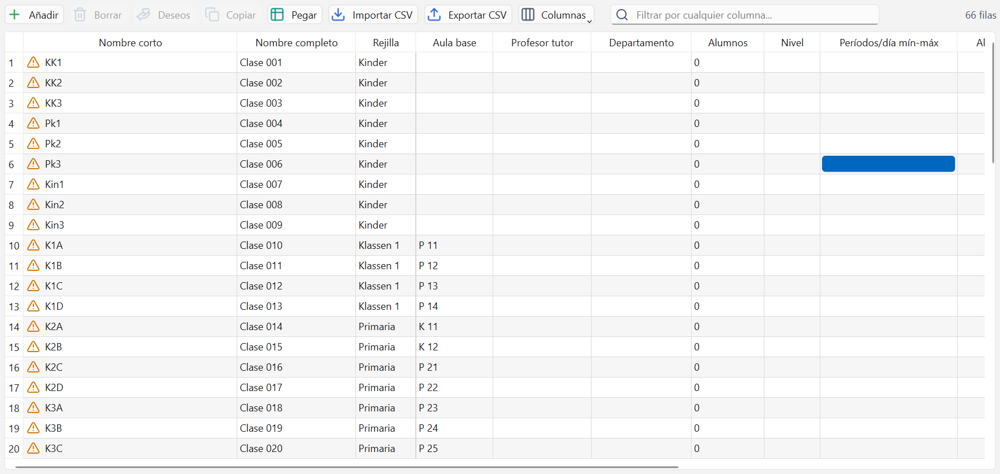

# Importar y exportar

Un colegio tiene 150 profesores y 900 lecciones: no se teclean uno a uno. Aquí se explica cómo
meter los datos de golpe desde Excel o desde Untis, y cómo sacarlos.

## Importar y exportar CSV de datos maestros

Las seis cuadrículas de [Datos maestros](02-datos-maestros.md) traen los botones **Importar CSV**
y **Exportar CSV**.



Para exportar:

1. Abre la ventana (Clases, Profesores, Aulas...) y pulsa **Exportar CSV**.
2. Elige dónde guardarlo. El archivo sale con punto y coma como separador y en UTF-8, que es lo
   que Excel necesita para abrir bien las tildes con un doble clic.

Para importar:

1. Pulsa **Importar CSV** y elige el archivo.
2. El programa enseña antes qué va a pasar: "Se va a importar «profesores.csv»: 116 fila(s)
   nueva(s), 0 actualizada(s) y 0 sin cambios en profesores." y pregunta "¿Continúo?".
3. Pulsa Sí. Todo entra en un solo paso de deshacer: si algo sale mal, Ctrl+Z lo revierte entero.

La ida y la vuelta no pierden nada: exportar, editar en Excel y volver a importar deja el mismo
proyecto, porque el archivo lleva todas las columnas.

## Pegar desde Excel con Ctrl+C y Ctrl+V

No hace falta pasar por un archivo. En la cuadrícula:

- **Ctrl+C** (botón **Copiar**) copia las filas seleccionadas al portapapeles, listas para pegarlas
  en una hoja de cálculo. Se copian solo las columnas visibles y en el orden en que se ven.
- **Ctrl+V** (botón **Pegar**) pega un bloque entero desde Excel.

El pegado se comporta de dos maneras, según dónde esté el cursor:

- Si pegas **sobre la columna del nombre corto**, cada línea es una fila completa: las que no
  existen se dan de alta y las que ya existen se actualizan.
- Si pegas **sobre cualquier otra columna**, el bloque cae sobre las filas que ya hay, desde la
  celda actual hacia abajo. Si sobran líneas, el aviso lo dice: "3 fila(s) del portapapeles no
  cabían: añádelas antes o pega sobre la columna del nombre corto."

En los dos casos se valida igual que al escribir celda a celda y todo entra como un solo paso de
deshacer.

## Qué encabezados se aceptan

La primera línea del archivo son los nombres de las columnas. Vale la etiqueta tal como se ve en
la cuadrícula ("Nombre corto", "Aula base", "Reserva para sustituir (0-9)"), su equivalente en
alemán, o el nombre interno del campo (`id`, `name`, `home_room`). No importan las mayúsculas, las
tildes, los espacios ni los signos: "nombre corto", "Nombre Corto" y "NOMBRECORTO" son lo mismo.

- El separador se deduce de la primera línea: punto y coma, coma o tabulador.
- La codificación también: UTF-8 con o sin marca de Excel, y Windows occidental como último
  recurso.
- Las columnas que no se reconocen se ignoran, pero quedan avisadas: "Columna desconocida:
  'Observaciones'".
- La columna del nombre corto es obligatoria. Sin ella no se importa nada: "Falta la columna del
  nombre corto («Nombre corto»)".
- El orden de las columnas da igual, y no hace falta traerlas todas.

Los valores se escriben como en la cuadrícula: los rangos con guion (`4-7`), las casillas de sí/no
con `x` (o `si`, `1`) para marcar y en blanco para dejar sin marcar, y las listas separadas por
comas.

## Importar y exportar lecciones

La ventana Lecciones tiene sus propios **Importar CSV** y **Exportar CSV**, y también **Copiar** y
**Pegar** con el mismo formato.


El formato es una tabla plana con **una fila por línea de acople**. Las columnas, en orden:

```
Lección;Materia;Profesor;Clases;Grupo de alumnos;Aula;Aula alternativa;Valor semanal;
Horas/semana;Dobles mín;Dobles máx;Bloque;Rejilla;Fijada;Ignorar;No el mismo día;
Valor semanal (lección)
```

De **Horas/semana** en adelante son columnas de la lección entera; las anteriores son de cada
línea. La única obligatoria es **Materia**: sin ella no se importa nada.

### Las lecciones con acople

Un acople es una lección que se da a la vez con varios profesores o varios grupos (los desdobles
y las optativas). En el archivo, **las filas con el mismo valor en la columna Lección son un
acople**, en el orden en que aparecen:

- Si el valor es un número, es el número de lección. Si ya existe, se actualiza entera; si no,
  se crea con ese número.
- Si es texto (`L1`, `bloque-ib`), solo sirve para agrupar las líneas de una lección nueva, que
  recibirá el siguiente número libre.
- Si está vacío, cada fila es una lección distinta de una sola línea.

Las columnas de la lección (horas por semana, dobles, rejilla, casillas) se leen de la primera
línea del grupo. Si una línea siguiente trae un valor distinto, esa fila da error. Al exportar
salen solo en la primera línea, igual que se ven en la ventana.

La columna **Clases** admite varias separadas por comas.

## Qué pasa cuando una fila tiene errores

Nunca se queda nada a medias:

- **Una fila con cualquier error no entra entera.** No se guardan sus columnas buenas y se
  descartan las malas.
- **Las demás filas sí entran**, y todas juntas en un único paso de deshacer.
- En las lecciones, la unidad es la lección completa: si falla una línea de un acople, se queda
  fuera la lección entera, para no meter medio acople.

El resumen dice cuántas entraron, cuántas no y por qué, con el número de fila del archivo:
"fila 14 (T022), columna «Rejilla»: la rejilla 'Primaria' no existe: créala antes en Datos
maestros -> Rejillas de tiempo". Si falta mucho de lo mismo, lo agrupa en una línea: "Faltan 6
rejillas de tiempo: Primaria, Kinder, Tarde...", y antes de importar avisa: "Da de alta eso
primero y vuelve a importar."

## En qué orden hay que cargar las cosas

Cada archivo nombra cosas que ya tienen que existir. Este es el orden que evita casi todos los
errores:

1. **Rejillas de tiempo**: se crean a mano en su ventana, no por CSV. Ver
   [Rejillas de tiempo](03-rejillas-de-tiempo.md).
2. **Departamentos**, si se van a usar.
3. **Aulas** y **Materias**.
4. **Profesores** (nombran departamento y aula base) y **Clases** (nombran rejilla, aula base,
   profesor tutor y departamento).
5. **Grupos de alumnos** (nombran materia y clases).
6. **Lecciones**, al final: necesitan materia, profesor, clases, aulas y rejilla.

## Importar de Untis

Si el colegio ya trabaja con Untis, no hay que volver a teclear nada.

1. En la pantalla de inicio pulsa la tarjeta **Importar de Untis**, o usa el botón **Importar** de
   la cinta (Ctrl+I).
2. Elige **Archivo XML de Untis...** si tienes el export XML, o **Carpeta con archivos GPU...** si
   tienes la carpeta de archivos GPU.
3. Revisa lo que entró en la lista "Primeros pasos" y en el Diagnóstico, y guarda con Ctrl+S: a
   partir de ahí el proyecto vive en su archivo .rsp.

El botón **Abrir** también acepta directamente archivos .xml y proyectos antiguos .bjs, además de
los .rsp de RealSchool.

## Exportar a Untis

Desde la ventana Horarios, el botón **Imprimir / Exportar** ofrece dos salidas hacia Untis:

- **Exportar XML (Untis)...**: todo el proyecto en un archivo XML para abrirlo en Untis.
- **Exportar GPU (MiUntisWeb)...**: los archivos GPU del horario activo, para subirlos a
  MiUntisWeb. Pide una carpeta de destino.

En el mismo menú están las salidas normales: imprimir, PDF y HTML, de un horario o de todos.

## Errores frecuentes

- **"Falta la columna del nombre corto («Nombre corto»)".** El archivo no trae la primera columna,
  o la primera línea no es el encabezado (a veces hay un título del colegio encima). Borra esas
  líneas sobrantes y deja los nombres de columna arriba del todo.
- **Se importaron 0 filas y todo salió en rojo por referencias.** Faltan las cosas a las que
  apuntan: casi siempre las rejillas de tiempo o los departamentos. Créalos primero y repite la
  importación; el mensaje dice exactamente cuáles faltan.
- **Las tildes salen con símbolos raros.** El archivo se guardó en Excel con otra codificación.
  Vuelve a exportar desde RealSchool, edita ese archivo y guárdalo como CSV UTF-8.
- **Pegué una columna y se descolocó todo.** Al copiar se copian solo las columnas visibles y en
  el orden en que se ven. Si ocultaste o moviste columnas, el bloque de Excel no coincide: usa
  **Restablecer columnas** antes de copiar o pegar.
