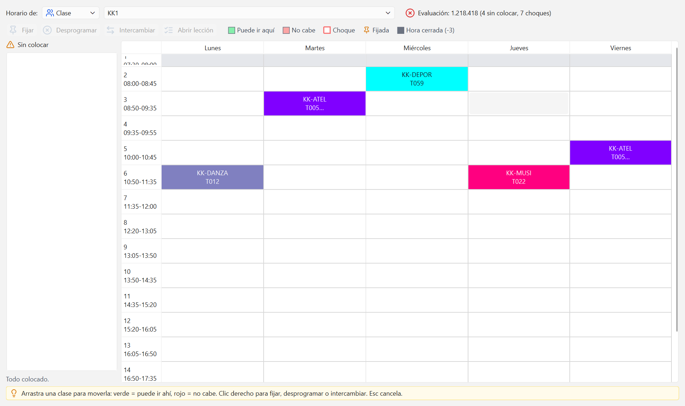

# Atajos y trucos

Las teclas que ahorran tiempo y unas cuantas costumbres que hacen el trabajo más corto. Nada de
esto es obligatorio: todo se puede hacer también con el ratón.

## Atajos de teclado

### Archivo

| Tecla | Qué hace |
| --- | --- |
| Ctrl+N | Nuevo: crea un colegio con el asistente |
| Ctrl+O | Abrir un proyecto o un archivo de Untis |
| Ctrl+I | Importar datos de Untis (XML o carpeta GPU) |
| Ctrl+S | Guardar |
| Ctrl+Shift+S | Guardar como |

### Edición

| Tecla | Qué hace |
| --- | --- |
| Ctrl+Z | Deshacer el último cambio |
| Ctrl+Y | Rehacer el cambio deshecho |
| Ctrl+C | Copiar las filas seleccionadas de una tabla |
| Ctrl+V | Pegar un bloque de filas en una tabla |
| Supr | Borrar la fila seleccionada de una tabla |

### Abrir ventanas

| Tecla | Ventana |
| --- | --- |
| Ctrl+0 | Inicio |
| Ctrl+1 | Rejillas de tiempo |
| Ctrl+2 | Clases |
| Ctrl+3 | Profesores |
| Ctrl+4 | Aulas |
| Ctrl+5 | Materias |
| Ctrl+6 | Lecciones |
| Ctrl+7 | Optimización |
| Ctrl+8 | Evaluación |
| Ctrl+9 | Horarios |
| Ctrl+Shift+T | Deseos de tiempo |
| Ctrl+Shift+P | Diálogo de planificación |
| Ctrl+Shift+D | Diagnóstico |
| Ctrl+Shift+L | Muestra u oculta el panel Registro |

### Ayuda y planificación manual

| Tecla | Qué hace |
| --- | --- |
| F1 | Ayuda de la ventana que tienes delante |
| Shift+F1 | Guía rápida: el flujo completo |
| F7 | En el Diálogo de planificación, desprograma la clase de la celda elegida |
| Esc | En el Diálogo de planificación, cancela el arrastre o el intercambio en curso |

Las ventanas que no tienen atajo propio se abren desde la cinta. Pasa el ratón por cualquier
botón y la ayuda emergente te dice qué hace y, entre paréntesis, su atajo.

## Moverse entre ventanas

La cinta de arriba agrupa todo en seis pestañas: **Inicio** (archivo, edición y ayuda), **Datos
maestros**, **Lecciones**, **Horarios**, **Módulos** (guardias y sustituciones) y **Vista**.

Cada ventana es un documento independiente y puedes tener varias abiertas a la vez. En la
pestaña **Vista**, el grupo **Ventanas** las coloca como quieras:

- **Mosaico**: todas a la vez, una junto a otra. Útil para comparar dos horarios.
- **Cascada**: superpuestas y escalonadas.
- **Pestañas**: una cada vez, con pestañas. Es lo más cómodo en pantallas pequeñas.

Cuando no hay ninguna ventana abierta aparece la página de Inicio con la lista de pasos. Vuelve
a ella con **Ctrl+0** en cualquier momento.

## Deshacer y rehacer

Todo lo que cambia el proyecto se puede deshacer, incluida la carga masiva de un CSV, el reparto
de guardias y las decisiones de sustitución. Un pegado de cien filas es **un solo paso** de
deshacer, no cien.

El truco está en el botón: pasa el ratón por **Deshacer** en la pestaña Inicio y verás qué se
va a deshacer exactamente ("Deshacer: Repartir guardias", "Deshacer: Añadir ausencia de T012").
Así sabes si estás a punto de tirar el trabajo bueno.

Lo que no se puede deshacer es guardar, exportar ni imprimir: esos no tocan el proyecto.

## Selección sincronizada

Elige una clase, un profesor, un aula o una materia en [Datos maestros](02-datos-maestros.md) y
las demás ventanas se ajustan solas: **Lecciones** filtra sus lecciones, **Deseos de tiempo**
enseña su rejilla de deseos, **Horarios** muestra su horario y el **Diálogo de planificación**
se coloca en él.

Es la forma rápida de revisar a una persona: abre Profesores y Horarios en mosaico, y ve
bajando por la lista de profesores. El horario de la derecha va cambiando solo.

En la ventana Horarios, la casilla **Sincronizar** de la barra superior activa o desactiva este
comportamiento ("Los horarios siguen lo que eliges en las demás ventanas"). Desactívala cuando
quieras dejar un horario fijo en pantalla mientras trabajas en otra cosa.

## Cambiar el idioma

Pestaña **Vista**, grupo **Idioma**: **Español** o **Deutsch**. El cambio es instantáneo y
afecta a toda la interfaz, incluidas la ayuda F1 y los nombres de las ventanas. No hace falta
reiniciar ni volver a abrir el proyecto.

## La ayuda F1

Pulsa **F1** en cualquier ventana y se abre la ayuda con la ficha de esa ventana: para qué
sirve, los pasos para usarla y algunos consejos. A la izquierda está la lista de todos los
temas, así que también sirve para curiosear.

**Shift+F1** abre directamente la **Guía rápida**: el orden en que se construye un horario, de
la rejilla de tiempo a la impresión.

## Seis trucos de planificación

**1. El marco horario antes que nada.** Antes de generar, di de qué hora a qué hora hay clase
en cada curso. En [Deseos de tiempo](04-deseos-y-marco-horario.md) pon **Hay clase de la hora:**
2 a 15, elige en **Aplicar a:** la opción "todos los de su rejilla" y pulsa **Aplicar marco
horario**. Con eso cierras de golpe las horas en las que el colegio ya no tiene servicio.

**2. Pega desde Excel.** En cualquier tabla de datos maestros, copia el bloque en la hoja de
cálculo y pulsa **Ctrl+V**. Entra entero, en un solo paso de deshacer, y el programa te avisa
antes de lo que va a pasar. Para el camino de vuelta, **Exportar CSV**.

**3. Genera corto, luego largo.** La primera pasada con una estrategia rápida sirve para ver si
el problema tiene solución. Si salen muchas horas sin colocar, no insistas con una estrategia
larga: el fallo está en los datos, y te lo dirá el [Diagnóstico](08-diagnostico-y-evaluacion.md).

**4. Fija lo intocable antes de volver a optimizar.** En el
[Diálogo de planificación](09-planificacion-manual.md), clic derecho sobre una clase y
**Fijar**. Las clases fijadas no se mueven en la siguiente optimización, así que puedes
regenerar sin perder lo que ya habías acordado. Lo mismo vale para las guardias: un turno
puesto a mano queda con chincheta.

**5. Guarda variantes antes de experimentar.** Un **Ctrl+Shift+S** con otro nombre cuesta dos
segundos y te deja probar ponderaciones raras sin miedo. Dentro de un mismo proyecto, cada
optimización se guarda como un horario nuevo y los anteriores no se pierden: en **Evaluación**
puedes elegir dos con **Ctrl+clic** y compararlos criterio a criterio.

**6. Guardias y sustituciones, al final.** Las [guardias de recreo](11-guardias-de-recreo.md)
se reparten sobre el horario ya generado, porque el programa necesita saber quién está en el
centro junto a cada recreo. Si después mueves clases, vuelve a repartir: los turnos con
chincheta se quedan y el resto se reajusta.

---

¿Te queda alguna duda? Mira las [preguntas frecuentes](15-preguntas-frecuentes.md).
